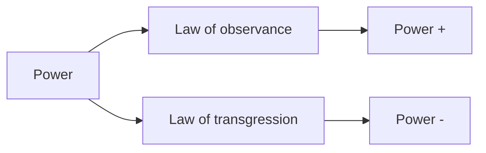
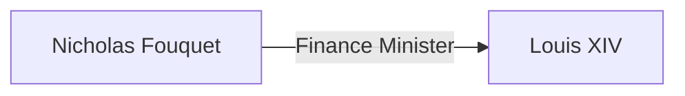

A book more about inducing paranoia and making it hard to trust people but with important lessons about life and decisions, absolutely amazing. A-- This is the text! ---B

###  Preface

- Like `janus`, double faced roman deity and guardian of all gateways and doorways, have a face which is looking in the future and also in the past, be wary of everything and be cautious. 
- No days unalert and calculate every pitfall that might emerge
- L9ook at the past but not to hurt yourself but to learn from those who came before you.
- patience will prevent you from making moronic blunders. you need to ensure that you are patient 
- As Nietzsche says, The value of thing is not decided by what we attain from it but what it costs us. 
- As baltasrr gracian says, Many people out there invest their tuime and energy in learning about plants and animals, only if that time was used to learn humans with whom we live or die. 

### Index

##### Never outshine the master
###### Transgression of the Law

* He was a generous man, who loved lavish parties and money, but then when Louis XIV ‘s prime minister died, he thought he will get the position but the king decided to rid of the position itself which made him think that he is losing favour of the king and so as to ingratiate himself to the position, he staged one of the most spectacular parties.
* La fontaine, La rouchefoucauld, Madame de sevigne, attended the parties, and it had a full blow 7 meal course with oriental food which was never seen in france before and along with that it had special meal prepared for party itself. 
* Along with all that, the chateau had spectacular gardens and he himself accompanied the young king to the tour and many other fun things.
* The next day Fouquet was arrested by the king on the charges of stealing the money from treasury which in truth he had done with the permission of king for the king himself. And three months later was sent to most isolated prison of france. 
###### Observance of the law
##### Never Put too much trust in friends, Learn how to use enemies
##### Conceal your Intentions
##### Always say less than necessary 
##### So much depends on reputation - Guard it with your life
##### Court Attention at all costs
##### Get others to do the work for you, but always take the credit
##### Make others come to you - Use bait if necessary
##### Win through actions, never through arguments
##### Infection: Avoid the unhappy and unlucky
##### Learn to keep people dependent on you
##### Use selective honesty and generosity to disarm your victim
##### When asking for help, appeal to their self interest never to gratitude/mercy.
##### Pose as friend work as spy
##### crush your enemies totally
##### Use Absence to increase respect and honor
##### Keep others in suspended terror, cultivate an air of unpredictability
##### Do not build fortresses to protect yourself, isolation is dangerous.
##### Know who you are dealing with, Do not offend the wrong person
##### Do not commit to anyone - Donot rush to take sides.
##### Seem dumber than your mark, play sucker to catch sucker
##### Use surrender tactic, transform weakness into power
##### concentrate your forces
##### Play the perfect courtier
##### Re-create yourself
##### Keep your hands clean
##### Play on people’s need to believe to create a cultlike following
##### Enter action with boldness 
##### Plan all the way to the end 
##### Make your accomplishments seem effortless
##### Control the options, get others to play with the cards you deal
##### Play to people’s fantasies
##### Discover each man’s thumbscrew
##### Be royal in your own fashion, act like a king to be treated like one. 
##### Master the art of timing
##### Disdain things you cannot have, ignoring them is the best revenge
##### create compelling spectacles
##### think as you like, but behave like others
##### Stir up water to catch fish
##### Despise the free lunch 
##### Avoid stepping into a great man’s shoe
##### Strike the shepherd and the sheep will scatter
##### Work on the heart and mind of others
##### Disarm and infuriate with the mirror effect
##### Preach the need for change, but never reform too much at oncec
##### Never appear too perfect
##### Donot go past the mark, in victory learn when to stop 
##### Assume formlessness
