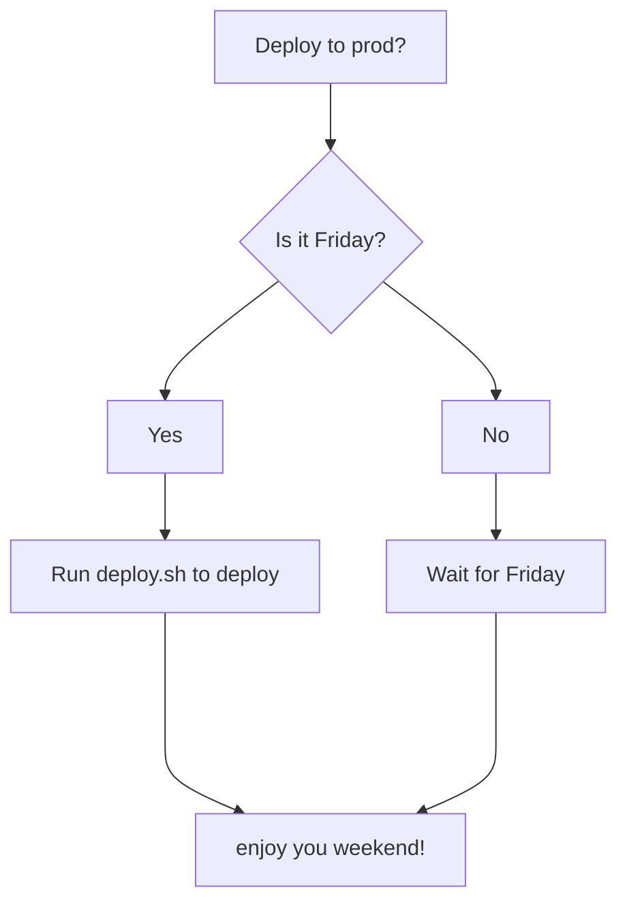

acreom makes it easy to capture and organize your large engineering tasks. You can:

- create tasks with `/`
- link to other documents or knowledge base by `[[`
- use [markdown](https://www.markdownguide.org/cheat-sheet/) to write specs and documentation
- track progress in tasks

When your project is complete, you can easily turn it into a documentation with Mermaid and code blocks.

### Code blocks
```
if (false == true) {
  // log some message
}
```


### Diagrams



See [acreom guide](https://sharing.acreom.com/d/24f8cc3c-649f-4b01-ae04-1e2a942b1fdf) to take full advantage of the app.

- [x] OK, Got it [[.tasks/OK, Got it]]

