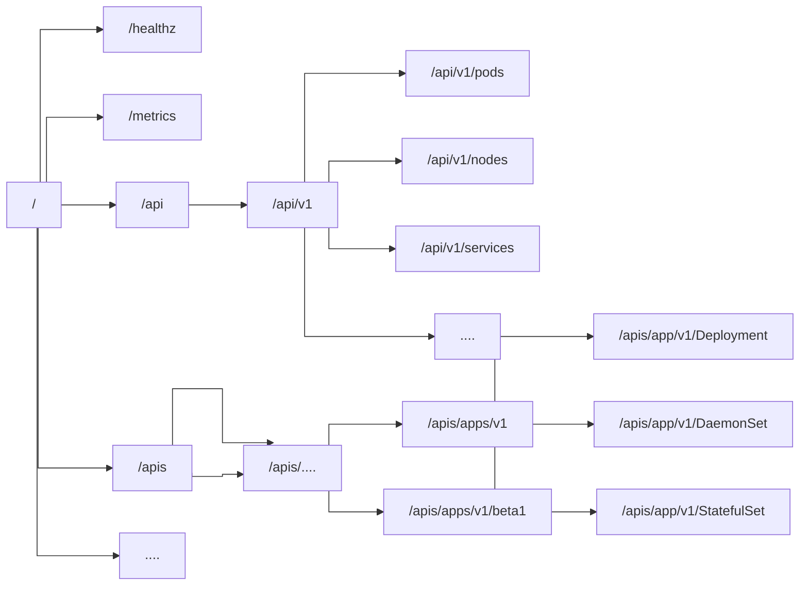

```
          
           _  __     _                          _            
          | |/ /   _| |__   ___ _ __ _ __   ___| |_ ___  ___ 
          | ' / | | | '_ \ / _ \ '__| '_ \ / _ \ __/ _ \/ __|
          | . \ |_| | |_) |  __/ |  | | | |  __/ ||  __/\__ \
          |_|\_\__,_|_.__/ \___|_|  |_| |_|\___|\__\___||___/
                                                             
```


### Introduction

* Kubernetes is a Container Orchestration System
* K[ubernete]s => k8s

#### Functions
1. Automatic Deployment
2. Load Distribution
3. Auto-Scaling
4. Monitoring & Health Check
5. Replacement of Failed Containers

* Supported Runtimes:
1. Docker
2. CRI-O
3. Containerd


### Architecture

1. Pod: Smallest Unit in the Kubernetes World


##### Anatomy of a Pod
```
           ┌─────────────────────────────────────────────────────┐
           │                                                     │
           │                 POD                                 │
           │                                                     │
           │   ┌──────────────┐          ┌─────────────┐         │
           │   │              │          │             │         │
           │   │  CONTAINER0  │          │  CONTAINER2 │         │
           │   └──────────────┘          └─────────────┘         │
           │                                                     │
           │   ┌──────────────┐                                  │
           │   │              │                                  │
           │   │  CONTAINER1  │              .....               │
           │   │              │                                  │
           │   └──────────────┘                                  │
           │                                                     │
           │   ┌──────────────────────────┐                      │
           │   │  Shared Resource         │                      │
           │   │  * IP                    │                      │
           │   │  * Volumes               │                      │
           │   └──────────────────────────┘                      │
           └─────────────────────────────────────────────────────┘
          
```
* One container Per pod is the most common case but its quite feasible to have more than one Container per pod.
 
##### Anatomy of Kubernetes Cluster
```
       ┌────────────────────────────────────────────────────────────────────────────┐
       │                                                                            │
       │                             Kubernetes Cluster                             │
       │                                                                            │
       │   ┌────────────────────────────────────────┐        ┌─────────────────┐    │
       │   │             Node0                      │        │      Node1      │    │
       │   │                                        │        └─────────────────┘    │
       │   │                                        │                               │
       │   │ ┌───────────────────────────────────┐  │                               │
       │   │ │           Pod0                    │  │        ┌─────────────────┐    │
       │   │ │                                   │  │        │      Node2      │    │
       │   │ │                                   │  │        └─────────────────┘    │
       │   │ │ ┌────────────┐  ┌────────────┐    │  │                               │
       │   │ │ │  Container0│  │ Container1 │    │  │                               │        
       │   │ │ └────────────┘  └────────────┘    │  │                               │
       │   │ └───────────────────────────────────┘  │                               │
       │   │              ....                      │               .....           │
       │   │                                        │                               │
       │   │   ┌────────────┐  ┌────────────┐       │                               │
       │   │   │  Pod0      │  │   Pod1     │       │                               │
       │   │   └────────────┘  └────────────┘       │        ┌─────────────────┐    │
       │   │                                        │        │      Node3      │    │
       │   └────────────────────────────────────────┘        └─────────────────┘    │
       │                                                                            │
       │                                                                            │
       └────────────────────────────────────────────────────────────────────────────┘
                
```

##### Architecture of Nodes

```
     ┌──────────────────────────────────────────────────────────────────────────────┐
     │                                                                              │
     │                          Kubernetes Cluster                                  │
     │                                                                              │
     │                                                                              │
     │                            ┌─────────────────┐                               │
     │                            │                 │                               │
     │             ┌──────────────┤   Master Node   ├───────────────┐               │
     │             │              └─────┬───────────┘               │               │
     │             │                    │                           │               │
     │             │                    │                           │               │
     │             ▼                    │                           ▼               │
     │       ┌────────────────┐         │                  ┌──────────────────┐     │
     │       │                │         │                  │                  │     │
     │       │  Worker Node   │         │                  │   Worker Node    │     │
     │       └────────────────┘         │                  └──────────────────┘     │
     │                                  ▼                                           │
     │                            ┌───────────────┐                                 │
     │                            │               │                                 │
     │                            │  Worker Node  │                                 │
     │                            └───────────────┘                                 │
     │                                                                              │
     │                                                                              │
     └──────────────────────────────────────────────────────────────────────────────▼

```


##### Kubernetes Services
```
  ┌─────────────────────────────────────────────────────────────────────────────────────────────────────────┐
  │                                                                                                         │
  │ ┌──────────────────────────────────────────┐                                                            │
  │ │                                          │                                                            │
  │ │                                          │                                                            │
  │ │         Master Nodes                     │                                                            │
  │ │                                          │      ┌─────────────────────────────────────────────────┐   │
  │ │  ┌────────────────────────────────────┐  │      │                                                 │   │
  │ │  │ * Api Server         ────────────────────┐   │               Worker Node                       │   │
  │ │  │ * Scheduler                        │  │  │   │                                                 │   │
  │ │  │ * Kube controller Manager          │  │  │   │                                                 │   │
  │ │  │ * Cloud Controller Manager         │  │  │   │ ┌───────────┐                                   │   │
  │ │  │ * etcd                             │  │  ├────►│  Kubelet  │              ┌──────────────────┐ │   │
  │ │  └────────────────────────────────────┘  │  │   │ └───────────┘              │container runtime │ │   │
  │ │                                          │  │   │ ┌────────────┐             └──────────────────┘ │   │
  │ │                                          │  │   │ │  kube-proxy│                                  │   │
  │ │                                          │  │   │ └────────────┘                                  │   │
  │ │ ┌────────────┐                           │  │   └─────────────────────────────────────────────────┘   │
  │ │ │ Kubelet    │     ┌──────────────────┐  │  │                                                         │
  │ │ └────────────┘     │ Container Runtime│  │  │   ┌─────────────────────────────────────────────────┐   │
  │ │                    └──────────────────┘  │  │   │                                                 │   │
  │ │ ┌────────────┐                           │  │   │               Worker Node                       │   │
  │ │ │ Kube-proxy │                           │  │   │                                                 │   │
  │ │ └────────────┘                           │  │   │                                                 │   │
  │ │                                          │  │   │ ┌───────────┐                                   │   │
  │ └──────────────────────────────────────────┘  └────►│  Kubelet  │              ┌──────────────────┐ │   │
  │                                                   │ └───────────┘              │container runtime │ │   │
  │                                                   │ ┌────────────┐             └──────────────────┘ │   │
  │                                                   │ │  kube-proxy│                                  │   │
  │                                                   │ └────────────┘                                  │   │
  │                                                   └─────────────────────────────────────────────────┘   │
  │                                                                                                         │
  └─────────────────────────────────────┬────┬──────────────────────────────────────────────────────────────┘
                                        │    │
                                        │    │
                                        │    │
                                        ▼    ▼
                                 ┌──────────────────┐
                                 │  Managed Using   │
                                 │      kubectl     │
                                 └──────────────────┘
```


#### Kubectl Commands

1. `kubectl get nodes | pods | namespace`s
2. `kubectl get pods --namespace=kube-system`
3. `kubectl run nginx --image=nginx`

***

### Theoretical Aspect related to k8s

#### Architecture

* At high level, k8s is a cluster of compute systems, there are two distinct roles
	1. Control Plane
	2. Worker Nodes


![[Pasted image 20230512203536.png]]

***

##### Control Plane

- Provides a running environment for control plane agents which are responsible for managing k8s cluster, brain behind the operations inside the cluster.
- Can be run in HA mode, very critical and must be always running
- Persistence of cluster state is achieved by keeping the cluster configuration data in key-value store of ETCD, even ETCD can be configured on control plane node (stacked topology) or on dedicated host (external topology)

Control Plane Components
1. API Server
2. Scheduler
3. Controller Manager
4. KV Store (ETCD)

Can be abbreviated as SACK - Scheduler, API Server, Controller Manager and KV Store (which is ETC
D)

Control Plane runs on
- Container runtime
- Node agent
- Proxy
- Optional Addons

###### API Server
- All administrative tasks are coordinated by kube-apiserver
- Server intercepts the calls and then validates+processes them
- kube-apiserver is the only component capable of talking to etcd

Using `/home/akuma/SoopaProject/Study/k8s/k8s-first-source-code/pkg/apiserver 

This is basically the checkout of first commit, hash `2c4b3a562ce34cddc3f8218a2c4d11c7310e6d56`
Which pretty much has some information about the design as such

```go
// RESTStorage is a generic interface for RESTful storage services
type RESTStorage interface {
	List(*url.URL) (interface{}, error)
	Get(id string) (interface{}, error)
	Delete(id string) error
	Extract(body string) (interface{}, error)
	Create(interface{}) error
	Update(interface{}) error
}

// Status is a return value for calls that don't return other objects
type Status struct {
	success bool
}

// ApiServer is an HTTPHandler that delegates to RESTStorage objects.
// It handles URLs of the form:
// ${prefix}/${storage_key}[/${object_name}]
// Where 'prefix' is an arbitrary string, and 'storage_key' points to a RESTStorage object stored in storage.
//
// TODO: consider migrating this to go-restful which is a more full-featured version of the same thing.
type ApiServer struct {
	prefix  string
	storage map[string]RESTStorage
}

```

Seems like api-server is mostly performing crud with the etcd and forwarding requests to the original components

```go
func (server *ApiServer) handleREST(parts []string, url *url.URL, req *http.Request, w http.ResponseWriter, storage RESTStorage) {
	switch req.Method {
	case "GET":
		switch len(parts) {
		case 1:
			controllers, err := storage.List(url)
			if err != nil {
				server.error(err, w)
				return
			}
			server.write(200, controllers, w)
		case 2:
			task, err := storage.Get(parts[1])
			if err != nil {
				server.error(err, w)
				return
			}
			if task == nil {
				server.notFound(req, w)
				return
			}
			server.write(200, task, w)
		default:
			server.notFound(req, w)
		}
		return
	case "POST":
		if len(parts) != 1 {
			server.notFound(req, w)
			return
		}
		body, err := server.readBody(req)
		if err != nil {
			server.error(err, w)
			return
		}
		obj, err := storage.Extract(body)
		if err != nil {
			server.error(err, w)
			return
		}
		storage.Create(obj)
		server.write(200, obj, w)
		return
	case "DELETE":
		if len(parts) != 2 {
			server.notFound(req, w)
			return
		}
		err := storage.Delete(parts[1])
		if err != nil {
			server.error(err, w)
			return
		}
		server.write(200, Status{success: true}, w)
		return
	case "PUT":
		if len(parts) != 2 {
			server.notFound(req, w)
			return
		}
		body, err := server.readBody(req)
		if err != nil {
			server.error(err, w)
		}
		obj, err := storage.Extract(body)
		if err != nil {
			server.error(err, w)
			return
		}
		err = storage.Update(obj)
		if err != nil {
			server.error(err, w)
			return
		}
		server.write(200, obj, w)
		return
	default:
		server.notFound(req, w)
	}

```


###### Scheduler

- Assign new workload objects such as pods encapsulating containers, to nodes. This is for the worker nodes
- During Scheduling, the decisions are made based on current kubernetes cluster state and new workload objects requiremetns.
- Scheduler fetches details from kv store via kube-apiserver, it also receives the workload requirements from api-server
	- It takes into account following things
		1. Users and Operators set
		2. Node labels
		3. Quality of Service
		4. data locality
		5. affinity
		6. anti-affinity
		7. taints
		8. tolerations
		9. cluster topology
- Once the data is available, the scheduler takes into account the available data and filters the nodes with predicates to isolate the possible node candidate which are scored with priorities in order to select the one node that satisfies all of the requirements. The outcome is then communicated back to api-server which then delegates the workload deployment to other control plane agents

Path: `/home/akuma/SoopaProject/Study/k8s/k8s-first-source-code/pkg/registry
Commit: `2c4b3a562ce34cddc3f8218a2c4d11c7310e6d56

```go
// Scheduler is an interface implemented by things that know how to schedule tasks onto machines.
type Scheduler interface {
	Schedule(Task) (string, error)
}

// RandomScheduler choses machines uniformly at random.
type RandomScheduler struct {
	machines []string
	random   rand.Rand
}

func MakeRandomScheduler(machines []string, random rand.Rand) Scheduler {
	return &RandomScheduler{
		machines: machines,
		random:   random,
	}
}

func (s *RandomScheduler) Schedule(task Task) (string, error) {
	return s.machines[s.random.Int()%len(s.machines)], nil
}

// RoundRobinScheduler chooses machines in order.
type RoundRobinScheduler struct {
	machines     []string
	currentIndex int
}

func MakeRoundRobinScheduler(machines []string) Scheduler {
	return &RoundRobinScheduler{
		machines:     machines,
		currentIndex: 0,
	}
}

func (s *RoundRobinScheduler) Schedule(task Task) (string, error) {
	result := s.machines[s.currentIndex]
	s.currentIndex = (s.currentIndex + 1) % len(s.machines) // this is neat af 
	return result, nil
}

type FirstFitScheduler struct {
	machines []string
	registry TaskRegistry
}

func MakeFirstFitScheduler(machines []string, registry TaskRegistry) Scheduler {
	return &FirstFitScheduler{
		machines: machines,
		registry: registry,
	}
}

func (s *FirstFitScheduler) containsPort(task Task, port Port) bool {
	for _, container := range task.DesiredState.Manifest.Containers {
		for _, taskPort := range container.Ports {
			if taskPort.HostPort == port.HostPort {
				return true
			}
		}
	}
	return false
}

func (s *FirstFitScheduler) Schedule(task Task) (string, error) {
	machineToTasks := map[string][]Task{}
	tasks, err := s.registry.ListTasks(nil)
	if err != nil {
		return "", err
	}
	for _, scheduledTask := range tasks {
		host := scheduledTask.CurrentState.Host
		machineToTasks[host] = append(machineToTasks[host], scheduledTask)
	}
	for _, machine := range s.machines {
		taskFits := true
		for _, scheduledTask := range machineToTasks[machine] {
			for _, container := range task.DesiredState.Manifest.Containers {
				for _, port := range container.Ports {
					if s.containsPort(scheduledTask, port) {
						taskFits = false
					}
				}
			}
		}
		if taskFits {
			return machine, nil
		}
	}
	return "", fmt.Errorf("Failed to find fit for %#v", task)
}


```


###### Controller Manager

- These guys run the operator processes to regulate the state of the k8s cluster
- watch-loop processes that continuously run and compare the cluster's current state with the desired state provided by etcd
- The **kube-controller-manager** runs controllers or operators responsible to act when nodes become unavailable, to ensure container pod counts are as expected, to create endpoints, service accounts, and API access tokens 

###### ETCD / KV Store

-  etcd is a strongly consistent, distributed **key-value data store** used to persist a Kubernetes cluster's state. New data is written to the data store only by appending to it, data is never replaced in the data store. Obsolete data is compacted (or shredded) periodically to minimize the size of the data store.
- etcd's CLI management tool - **etcdctl**, provides snapshot save and restore capabilities which come in handy especially for a single etcd instance Kubernetes cluster - common in Development and learning environments. However, in Stage and Production environments, it is extremely important to replicate the data stores in HA mode, for cluster configuration data resiliency.

The two ways of deploying etcd are:
1. Stacked - here all the components are in one place on one server, and thats the master node
2. External topology - here etcd is separated out in its own ha cluster

The strong consistency is achieved using raft algorithm. 


##### Worker Nodes

- Provides a running environment for client applications, these are microservices running as application containers, encapsulated in pods, controlled by SACK. In multi-worker kubernetes cluster, the network traffic between client+users and containerized application deployed in pods is handled directly by the worker nodes, and its not routed through the control plane node. 

Worker Nodes components:
- Container Runtime
- Node agent - Kubelet
- Proxy - Kube-proxy
- Addons for DNS/Dashboard/Cluster Level monitoring and logging

###### Container Runtime

K8s requires a container runtime on the node where the pods are to be scheduled, these runtimes are required on all nodes. 
We can use following runtimes:
- CRI-O
- containerd
- Docker Engine
- Mirantis Contaienr runtime (docker enterprise)

###### Kubelet

- Agent on each node, control plane and workers. 
- Receives pod definitions from api-server and runs them
- monitors their health and resources as welll
- The kubelet connects to container runtimes through a plugin based interface - the [Container Runtime Interface](https://github.com/kubernetes/community/blob/master/contributors/devel/sig-node/container-runtime-interface.md) (CRI). The CRI consists of protocol buffers, gRPC API, libraries, and additional specifications and tools. In order to connect to interchangeable container runtimes, kubelet uses a **CRI shim**, an application which provides a clear abstraction layer between kubelet and the container runtime.

![[Pasted image 20230512233949.png]]

###### Kube Proxy
The **kube-proxy** is the network agent which runs on each node, control plane and workers, responsible for dynamic updates and maintenance of all networking rules on the node. It abstracts the details of Pods networking and forwards connection requests to the containers in the Pods. 

The kube-proxy is responsible for TCP, UDP, and SCTP stream forwarding or random forwarding across a set of Pod backends of an application, and it implements forwarding rules defined by users through Service API objects.

###### Addons
**Add-ons** are cluster features and functionality not yet available in Kubernetes, therefore implemented through 3rd-party pods and services.

-   **DNS  
    **Cluster DNS is a DNS server required to assign DNS records to Kubernetes objects and resources.
-   **Dashboard**   
    A general purpose web-based user interface for cluster management.
-   **Monitoring**   
    Collects cluster-level container metrics and saves them to a central data store.
-   **Logging**   
    Collects cluster-level container logs and saves them to a central log store for analysis.


Decoupled microservices based applications rely heavily on networking in order to mimic the tight-coupling once available in the monolithic era. Networking, in general, is not the easiest to understand and implement. Kubernetes is no exception - as a containerized microservices orchestrator it needs to address a few distinct networking challenges:

-   Container-to-Container communication inside Pods
	- Making use of the underlying host operating system's kernel virtualization features, a container runtime creates an isolated network space for each container it starts. On Linux, this isolated network space is referred to as a **network namespace**. A network namespace can be shared across containers, or with the host operating system. When a grouping of containers defined by a Pod is started, a special infrastructure **Pause container** is initialized by the Container Runtime for the sole purpose of creating a network namespace for the Pod. All additional containers, created through user requests, running inside the Pod will share the Pause container's network namespace so that they can all talk to each other via localhost.
	
-   Pod-to-Pod communication on the same node and across cluster nodes
-   Service-to-Pod communication within the same namespace and across cluster namespaces
-   External-to-Service communication for clients to access applications in a cluster

All these networking challenges must be addressed before deploying a Kubernetes cluster.


###### Networking Challenges

- Container - to - Container Communication: Happens via linux-namespace
	- When a group of containers defined by pod is started a special infrastructure, **pause container** is started for the sole purpose of creating a network namespace for the pods.
- pop-to-pod communication: 
	- The k8s network model aims to reduce complexity, and it treats pods as VM on network, and each of the pods get their own ip-per-pod
	- Containers share pods network namespace and must coordinate ports assignment inside the pod just as applications would on a VM, all while being able to communicate with each other on localhost - inside the pod. 
- Service to pod communication:
	- Same namespace and across cluster namespaces
	- 
- External to Service Communication:
	-  Kubernetes enables external accessibility through **Services**, complex encapsulations of network routing rule definitions stored in **iptables** on cluster nodes and implemented by **kube-proxy** agents. By exposing services to the external world with the aid of **kube-proxy**, applications become accessible from outside the cluster over a virtual IP address and a dedicated port number.


#### K8s Configuration

As we have seen that there are 3 components mainly in k8s
1. Control Plane
2. ETCD
3. Worker Nodes

Which gives us 6 different combinations out of which one is invalid (ETCD+WORKERNODES) So ignoring that one, we have five ways to orchestrate our system

1. **(Control Plane+ETCD+WorkerNodes)** - All in One : Ideal for studying+testing on local
2. **(ControlPlane+ETCD) + Multiple WorkerNodes** - Single control plane and multiple worker architecture: Stacked ETCD instance, single control plane handles many workers
3. **Controlplane + ETCD + WorkerNodes** - This is basically resilient ETCD structure wherein ETCD is external
4. **Multi ControlPlane and Multi Worker** - Highly Resilient High Cost factor
5. **Multi-Control Plane with Multi-Node etcd, and Multi-Worker Installation**  
In this setup, we have multiple control plane nodes configured in HA mode, with each control plane node paired with an external etcd instance.

##### K8s Deployment Tools

1. Testing/Local/ Non Production:
	- Minikube
	- Kind
	- Docker Desktop
	- Microk8s
	- k3s
1. Production Setup:
	-  Kubeadm
	- kubespray
	- kops


##### API Accessing




##### Kubernetes Buildiing blocks

##### Nodes
[Nodes](https://kubernetes.io/docs/concepts/architecture/nodes/) are virtual identities assigned by Kubernetes to the systems part of the cluster - whether Virtual Machines, bare-metal, Containers, etc. These identities are unique to each system, and are used by the cluster for resources accounting and monitoring purposes, which helps with workload management throughout the cluster.
##### Namespaces
If multiple users and teams use the same Kubernetes cluster we can partition the cluster into virtual sub-clusters using [Namespaces](https://kubernetes.io/docs/concepts/overview/working-with-objects/namespaces/). The names of the resources/objects created inside a Namespace are unique, but not across Namespaces in the cluster.
##### Pods
A [Pod](https://kubernetes.io/docs/concepts/workloads/pods/) is the smallest Kubernetes workload object. It is the unit of deployment in Kubernetes, which represents a single instance of the application.

###### Example k8s Manifest
```yaml
apiVersion: v1
kind: Pod
metadata:
  name: nginx-pod
  labels:
    run: nginx-pod
spec:
  containers:
  - name: nginx
    image: nginx:1.22.1
    ports:
    - containerPort: 80
```

##### Labels
[Labels](https://kubernetes.io/docs/concepts/overview/working-with-objects/labels/) are **key-value pairs** attached to Kubernetes objects (e.g. Pods, ReplicaSets, Nodes, Namespaces, Persistent Volumes). Labels are used to organize and select a subset of objects, based on the requirements in place. Many objects can have the same Label(s). Labels do not provide uniqueness to objects. Controllers use Labels to logically group together decoupled objects, rather than using objects' names or IDs.
##### Label Selectors
Controllers, or operators, and Services, use [label selectors](https://kubernetes.io/docs/concepts/overview/working-with-objects/labels/#label-selectors) to select a subset of objects. Kubernetes supports two types of Selectors:

- **Equality-Based Selectors  
    **Equality-Based Selectors allow filtering of objects based on Label keys and values. Matching is achieved using the **=**, **==** (equals, used interchangeably), or **!=** (not equals) operators. For example, with **env==dev** or **env=dev** we are selecting the objects where the **env** Label key is set to value **dev**. 
- **Set-Based Selectors  
    **Set-Based Selectors allow filtering of objects based on a set of values. We can use **in**, **notin** operators for Label values, and **exist/does not exist** operators for Label keys. For example, with **env in (dev,qa)** we are selecting objects where the **env** Label is set to either **dev** or **qa**; with **!app** we select objects with no Label key **app**.

##### Replication Controller
- Replication controller are operators that allow us to control the number of replicas, It consistently polls the number of pods and then compares it with the desired state. If pods are greater than desired state, it kills some randomly. if less, then spawns randomly. Its not recommended anymore, instead Deployments are suggested which configure a replicaset to achieve similar functionality.

###### Replicaset v/s Replication Controller
- Replicaset work on both set based selectors and kv selectors, where as replication controller only works on kv selectors
- The number of pods can be scaled up or down in replicaset with the help of autoscaler. Not sure on how its done in replication controllers

```yaml
**apiVersion: apps/v1  
kind: ReplicaSet  
metadata:  
  name: frontend  
  labels:  
    app: guestbook  
    tier: frontend  
spec:  
  replicas: 3  
  selector:  
    matchLabels:  
      app: guestbook  
  template:  
    metadata:  
      labels:  
        app: guestbook  
    spec:  
      containers:  
      - name: php-redis  
        image: gcr.io/google_samples/gb-frontend:v3**
```

- ReplicaSets can be used independently as Pod controllers but they only offer a limited set of features. A set of complementary features are provided by Deployments, the recommended controllers for the orchestration of Pods. Deployments manage the creation, deletion, and updates of Pods. A Deployment automatically creates a ReplicaSet, which then creates a Pod. There is no need to manage ReplicaSets and Pods separately, the Deployment will manage them on our behalf.

##### Deployments

- Deployments k8s object provides us with a declaritive updates on pod and replicasets.
- Deployment controller is part of control plane and it always ensures that the current state == desired state.
- Along with that it also provides us with multiple deployment strategy such as:
	- Rollout
	- Rollback
	- Recreate (more disruptive, less popular)

```yaml
apiVersion: apps/v1
kind: Deployment
metadata:
  name: nginx-deployment
  labels:
    app: nginx-deployment
spec:
  replicas: 3
  selector:
    matchLabels:
      app: nginx-deployment
  template:
    metadata:
      labels:
        app: nginx-deployment
    spec:
      containers:
      - name: nginx
        image: nginx:1.20.2
        ports:
        - containerPort: 80
```

##### Daemon Sets
- These are special pods which are ensured that atleast one of them are running on each of the node.
- Helpful in monitoring, logging, shipping, setups.
- One important thing to note is that the daemon sets are created and maintained by the controller itself, not via job-scheduler
- The placement however is still governed by the scheduler, this can be achieved by pods scheduling properties such as:
	- Taints
	- Tolerations
	- node selectors
	- node affinity

```yaml
apiVersion: apps/v1
kind: DaemonSet
metadata:
  name: fluentd-agent
  namespace: kube-system
  labels:
    k8s-app: fluentd-agent
spec:
  selector:
    matchLabels:
      k8s-app: fluentd-agent
  template:
    metadata:
      labels:
        k8s-app: fluentd-agent
    spec:
      containers:
      - name: fluentd-agent
        image: quay.io/fluentd_elasticsearch/fluentd:v2.5.2
```

##### Kubernetes Services
- Ways to expose services for connectivity with other services/clients. 
- Important and shall be covered in more depth later. 


#### Authentication, Authorization and Admission Control

To access and manage Kubernetes resources or objects in the cluster, we need to access a specific API endpoint on the API server. Each access request goes through the following access control stages: 

- **Authentication**  
    Authenticate a user based on credentials provided as part of API requests.
- **Authorization**  
    Authorizes the API requests submitted by the authenticated user.
- **Admission Control**  
    Software modules that validate and/or modify user requests.

