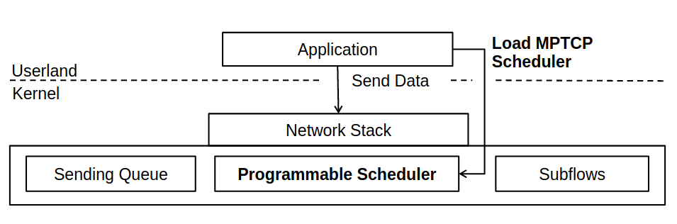

# Introduction

### Overview

The Internet is the global system of interconnected computer networks that uses the Internet protocol suite to communicate between networks and devices. It is a network of networks that consists of private, public, academic, business, and government networks of local to global scope, linked by a broad array of electronic, wireless, and optical networking technologies, It is mostly backed by udp/tcp. 
The Transmission Control Protocol (TCP) is used by the vast majority of applictions to transport their data reliably across the Internet. These applications are and not limited to, http, ftp, scp,sftp.  TCP was designed in the 1970s, along with an entire stack of itself called as TCP/Stack and neither mobile devices nor computers with many network interfaces were an immediate design priority.

On the other hand, the TCP designers knew that network links could fail, and they chose to decouple the network-layer protocols (Internet Protocol) from those of the transport layer (TCP) so that the network could reroute packets around failures without affecting TCP connections. Later on a further more advanced layer was designed, which seggregated the complexity a lot more well.  This ability to reroute packets is largely due to the use of dynamic routing protocols, and their job is made much easier because they don’t need to know anything about transportlayer connections.
The entire layer works by abstraction and functioning well, meaning a layer is only concerned with what it is supposed to do, and need not bother about how the layer above handle the data. 

As noted above, the primary purpose of the TCP is to provide reliable, securable logical circuit or connection service between pairs of processes.

 To provide this service on top of a less reliable internet communication system requires facilities in the following areas: Basic Data Transfer Reliability Flow Control Multiplexing Connections Precedence and Security The basic operation of the TCP in each of these areas is described in the following paragraphs.

**Basic Data Transfer**: The TCP is able to transfer a continuous stream of octets in each direction between its users by packaging some number of octets into segments for transmission through the internet system. In general, the TCPs decide when to block and forward data at their own convenience. Sometimes users need to be sure that all the data they have submitted to the TCP has been transmitted. For this purpose a push function is defined. To assure that data submitted to a TCP is actually transmitted the sending user indicates that it should be pushed through to the receiving user. A push causes the TCPs to promptly forward and deliver data up to that point to the receiver. The exact push point might not be visible to the receiving user and the push function does not supply a record boundary marker.

**Reliability:** The TCP must recover from data that is damaged, lost, duplicated, or delivered out of order by the internet communication system. This is achieved by assigning a sequence number to each octet transmitted, and requiring a positive acknowledgment (ACK) from the receiving TCP. If the ACK is not received within a timeout interval, the data is retransmitted. At the receiver, the sequence numbers are used to correctly order segments that may be received out of order and to eliminate duplicates. Damage is handled by adding a checksum to each segment transmitted, checking it at the receiver, and discarding damaged segments. As long as the TCPs continue to function properly and the internet system does not become completely partitioned, no transmission errors will affect the correct delivery of data. TCP recovers from internet communication system errors.

**Flow Control:** TCP provides a means for the receiver to govern the amount of data sent by the sender. This is achieved by returning a "window" with every ACK indicating a range of acceptable sequence numbers beyond the last segment successfully received. The window indicates an allowed number of octets that the sender may transmit before receiving further permission.

**Multiplexing:** To allow for many processes within a single Host to use TCP communication facilities simultaneously, the TCP provides a set of addresses or ports within each host. Concatenated with the network and host addresses from the internet communication layer, this forms a socket. A pair of sockets uniquely identifies each connection. That is, a socket may be simultaneously used in multiple connections. The binding of ports to processes is handled independently by each Host. However, it proves useful to attach frequently used processes (e.g., a "logger" or timesharing service) to fixed sockets which are made known to the public. These services can then be accessed through the known addresses. Establishing and learning the port addresses of other processes may involve more dynamic mechanisms.

**Connections:** The reliability and flow control mechanisms described above require that TCPs initialize and maintain certain status information for each data stream. The combination of this information, including sockets, sequence numbers, and window sizes, is called a connection. Each connection is uniquely specified by a pair of sockets identifying its two sides. When two processes wish to communicate, their TCP's must first establish a connection (initialize the status information on each side). When their communication is complete, the connection is terminated or closed to free the resources for other uses. Since connections must be established between unreliable hosts and over the unreliable internet communication system, a handshake mechanism with clock-based sequence numbers is used to avoid erroneous initialization of connections. Precedence and Security: The users of TCP may indicate the security and precedence of their communication. Provision is made for default values to be used when these features are not needed.

```bash
   +------+ +-----+ +-----+       +-----+                    
   |Telnet| | FTP | |Voice|  ...  |     |  Application Level 
   +------+ +-----+ +-----+       +-----+                    
         |   |         |             |                       
        +-----+     +-----+       +-----+                    
        | TCP |     | RTP |  ...  |     |  Host Level        
        +-----+     +-----+       +-----+                    
 |           |             |                       
        +-------------------------------+                    
        |    Internet Protocol & ICMP   |  Gateway Level     
        +-------------------------------+                    
             |                                     
+---------------------------+                      
|   Local Network Protocol  |    Network Level     
+---------------------------+                      

           [Figure 1: Protocol Relationships]
```

<div style='page-break-before:always'></div>

### Background

Today’s networks are multipath: mobile devices have multiple wireless interfaces, datacenters have many redundant paths between servers, and multihoming has become the norm for big server farms. Meanwhile, TCP is essentially a single-path protocol: when a TCP connection is established, the connection is bound to the IP addresses of the two communicating hosts. If one of these addresses changes, for whatever reason, the connection will fail. In fact, a TCP connection cannot even be load balanced across more than one path within the network, because this results in packet reordering, and TCP misinterprets this reordering as congestion and slows down.

When the Transmission Control Protocol (TCP) was first designed in 1974 as a part of the Internet Protocol Suite, the idea revolved around a single device with a single network connection. Since then the times have changed to supply different demands. In 2014 64% of the American adult population owned a smartphone. A smartphone typically supports both a 2G/3G/4G connection as well as a Wi- Fi connection. Even though smartphones have been around for a series of years, there is a very limited usage of a protocol that utilizes the multiple connections, available on the smartphone, to either aggregate bandwidth or as a reliability tool.

 A typically smartphone works by using either the 2G/3G/4G connection or the Wi- Fi connection and then it uses different techniques for the handover or handoff part. None of the most used smartphone operating systems uses multiple connections simultaneously even though the technology already exists. Seen from the users point of view, it might be beneficial sometimes to use all of the available connections, e.g. when downloading a large file, to decrease the download time.

Not only cellphones, even embedded devices such as raspberry pi and laptops (yes laptops make atleast 40% of electronic equipments), these devices are very well equipped with ethernet adapters and wifi adapters. Not only that these devices are well equipped with properly functioning drivers (broadcom on raspberry pi 3b+, rtl8723* series for Hp laptop/netbooks). Not utilising them well is sheer wastage of resources and lack of utilisation.

Multipath TCP (MPTCP) is a major modification to TCP that allows multiple paths to be used simultaneously by a single transport connection. Multipath TCP circumvents the issues mentioned above and several others that affect TCP. Changing TCP to use multiple paths is not a new idea; it was originally proposed more than 15 years ago by Christian Huitema in the Internet Engineering Task Force (IETF), and there have been a half-dozen more proposals since then to similar effect. Multipath TCP draws on the experience gathered in previous work, and goes further to solve issues of fairness when competing with regular TCP and deployment issues as a result of middleboxes in today’s Internet. The Multipath TCP protocol has recently been standardized by the IETF, and an implementation in the Linux kernel is available today.

#### Overview of MPTCP Operation

The design of Multipath TCP has been influenced by many requirements, but there are two that stand out the most: first is application compatibility and second one is network compatibility. Compatibility of Application basically implies that applications that today run over TCP should work without any change over Multipath TCP, this is to ensure two major functionalities:

* Fallback Compatibility

* Enhanced reliability 

Next, Multipath TCP must operate over any Internet path where TCP operates, this means that there is no need to modify the existing infrastructure for switching to MPTCP. Many paths on today’s Internet include middleboxes, such as Network Address Translators, firewalls, and various kinds of transparent proxies. Unlike IP routers, all these devices do know about the TCP connections they forward and affect them in special ways. Designing TCP extensions that can safely traverse all these middleboxes has proven to be challenging. Before diving into the details of Multipath TCP, as we now that the basic operation of normal TCP.

A connection can be divided into three phases: 

* connection establishment 

* data transfer 

* connection release

```bash
       +-------------------------------+
       |           Application         |
       +-------------------------------+
    ^                  |
    ~~~~~~~~~~|~Sockets Interface|~~~~~~~~~
    |                  v
       +-------------------------------+
       |             MPTCP             |
       + - - - - - - - + - - - - - - - +
       | Subflow (TCP) | Subflow (TCP) |
       +-------------------------------+
       |       IP      |      IP       |
       +-------------------------------+

        [Figure 2: MPTCP Protocol Stack]
```

#### Multipath TCP in the Networking Stack

MPTCP operates at the transport layer and aims to be transparent to
 both higher and lower layers. It is a set of additional features on
 top of standard TCP; Figure 3 illustrates this layering. MPTCP is
 designed to be usable by legacy applications with no changes;

```bash
             +-------------------------------+
             |           Application         |
  +---------------+    +-------------------------------+
  |  Application  |    |             MPTCP             |
  +---------------+    + - - - - - - - + - - - - - - - +
  |      TCP      |    | Subflow (TCP) | Subflow (TCP) |
  +---------------+    +-------------------------------+
  |      IP       |    |       IP      |      IP       |
  +---------------+    +-------------------------------+

  [Figure 3: Comparison of Standard TCP and MPTCP Protocol Stacks]
```

#### Terminologies

* **Path:** A sequence of links between a sender and a receiver, defined
   in this context by a 4-tuple of source and destination address/
   port pairs.

* **Subflow:** A flow of TCP segments operating over an individual path,
   which forms part of a larger MPTCP connection. A subflow is
   started and terminated similar to a regular TCP connection.
   (MPTCP) Connection: A set of one or more subflows, over which an
   application can communicate between two hosts. There is a one-to-
   one mapping between a connection and an application socket.

* **Data-level:** The payload data is nominally transferred over a
   connection, which in turn is transported over subflows. Thus, the
   term "data-level" is synonymous with "connection level", in
   contrast to "subflow-level", which refers to properties of an
   individual subflow

* **Token:** A locally unique identifier given to a multipath connection
   by a host. May also be referred to as a "Connection ID".
   Host: An end host operating an MPTCP implementation, and either
   initiating or accepting an MPTCP connection.

#### MPTCP Concepts and Working

This section provides a high-level summary of normal operation of
 MPTCP, and is illustrated by the scenario shown in Figure 4.

* To a non-MPTCP-aware application, MPTCP will behave the same as
  normal TCP. Extended APIs could provide additional control to
  MPTCP-aware applications [6]. An application begins by opening a
  TCP socket in the normal way. MPTCP signaling and operation are
  handled by the MPTCP implementation.

* An MPTCP connection begins similarly to a regular TCP connection.
   This is illustrated in Figure 2 where an MPTCP connection is
   established between addresses A1 and B1 on Hosts A and B,
   respectively.

* If extra paths are available, additional TCP sessions (termed
   MPTCP "subflows") are created on these paths, and are combined
   with the existing session, which continues to appear as a single
   connection to the applications at both ends. The creation of the
   additional TCP session is illustrated between Address A2 on Host A
   and Address B1 on Host B.

* MPTCP identifies multiple paths by the presence of multiple
   addresses at hosts. Combinations of these multiple addresses
   equate to the additional paths. In the example, other potential
   paths that could be set up are A1<->B2 and A2<->B2. Although this
   additional session is shown as being initiated from A2, it could
   equally have been initiated from B1.

* The discovery and setup of additional subflows will be achieved
   through a path management method; this document describes a
   mechanism by which a host can initiate new subflows by using its
   own additional addresses, or by signaling its available addresses
   to the other host.

* MPTCP adds connection-level sequence numbers to allow the
   reassembly of segments arriving on multiple subflows with
   differing network delays.

* Subflows are terminated as regular TCP connections, with a four-
   way FIN handshake. The MPTCP connection is terminated by a
   connection-level FIN.

```bash
     Host A                      Host B
 ------------------------    ------------------------
 Address A1    Address A2    Address B1    Address B2
 ----------    ----------    ----------    ----------
     |            |              |             |
     |  (initial connection)     |             |
     |-------------------------->|             |
     |<--------------------------|             |
     |    |                      |             |
     |   (additional subflow setup)            |
     |    |--------------------->|             |
     |    |<---------------------|             |
     |    |                      |             |
     |    |                      |             |

      [Figure 4: Example MPTCP Usage Scenario]
```

### Problem Statement

As we have seen that MPTCP is a very capable protocol as it enables us usage of multiple interfaces allowing us to effectively utilise the bandwidth and various other features. My problem statement is whether the MPTCP can be brought into the real world effectively and explore the challenges (and overcome them if possible) that might come into the way. 

One of the major problems that researchers face upon trying to work on MPTCP is the setting up of a decent environment. No doubt that there are enough resources on the internet which can help one out in setting up of an environment, but they all lack one thing, that is the error resolving techniques. Some of the posts are not even up-to-date to the latest details and updates. The purpose of this research project is simply to set up a basic environment for testing and experimenting with MPTCP. It can also be used by novice users to use MPTCP in their day to day life(as illustrated by title), though it is not recommended. It must be noted that MPTCP is still in its early experimental phase. Fortunately the people are already working on it and making it better.

Also, we will see how to set up the simulation environment of mptcp in Ubuntu machines, along with various other machines as well. The choice of Ubuntu machine is mostly because of its easier usage and easier setup. For other types of available machines, the process almost remains the same (if  its available in the software repository, or else one will have to compile from the source).

### Objective and Purpose

Objectively, We want to find and conduct experiments on all possible devices with support for MPTCP, we shall also look into various scheduling algorithms so as to find out the one which is more suited for which sort of purposes. 

Along with it, we shall try to see if there is a platform that is not supported and experiment upon supporting it. We shall also look into acquiring details and methodologies to make sure how to obtain them so that the further researchers need not waste time in exploring various scenarios and things unnecessarily.

After setting up the MPTCP environment we shall be working on Multiple algorithms so as to find out the optimal algorithm for multiple scenario.

This certainly involves working with multiple simulators and objects. We are also working on  implementing our own algorithm for scheduling.

We are going to see the installation of MPTCP on every possible machine, then we shall explore the tools, security mechanisms, simulation strategies and various Research tools.This shall save time for the future generation and allow them to focus on creating then experimenting. 

### Period of Project

The time period of the entire research is one and a half years, and still ongoing. Duration is from December 2018 to February 2020 (Semester 6,7,8)

* *Semester 6* : In semester 6, Review of literature was done. Tonnes of research papers along with the rfc's and official documentation. If I were to start installing it onto machines I must know what all has been done and what must be done.

* *Semester 7*: In Semester 7, I started with implementations and installations, exploring all the options and fixing the issues and the bugs that arose in the times. 

* *Semester 8*: In semester 8, after being done with installations all that remained was to play around with various scheduling algorithms and see how they can be utilised to enhance the experience and also see if any modification was required.

### Scope of Project

Multipath TCP was designed to be backward compatible with regular TCP. As such, it can support any application. However, some specific deployments leverage the ability of simultaneously using different paths.

Apple uses Multipath TCP to support the Siri application on iPhone. Siri sends voice samples over an HTTPS session to Apple servers. Those servers reply with the information requested by the users. According to Apple engineers, the main benefits of Multipath TCP with this application are :

* User-feedback (Time-to-First-Word) 20% faster in the 95th percentile

* 5x reduction of network failures

Other deployment use Multipath TCP to aggregate the bandwidth of different networks. For example, several types of smartphones, notably in Korea, use Multipath TCP to bond WiFi and 4G through SOCKS proxies. Another example are the Hybrid Access Networks that are deployed by network operators willing to combine xDSL and LTE networks. In this deployment, Multipath TCP is used to efficiently balance the traffic over xDSL and the LTE network.

In a more simpler terms, MPTCP has also proven well to provide client side load balancing without any need of nulky/costly equipments. 

Henceforth, MPTCP not only has extended the capabilities of internet in households but also in industries areas and cloud networking.

Other than these, It has been noted that since the subflows are split across multiple interfaces it prevents even the capturing of packets there by preventing MITM and identical attacks. DNS resolution over MPTCP allows faster internet resolutions, and seggregation of workload enables far more effective utilisation. 

If these were not enough, it is something that is even being developed (or rather have its tools developed by NASA itself) [Software Details](https://software.nasa.gov/software/LEW-19620-1)

<div style='page-break-before:always'></div>

# Literature Review

The first and foremost location from where the entire research began were rfc documents, summaries of each of these is henceforth added:

**RFC: 793** <u>TRANSMISSION CONTROL PROTOCOL</u>

This document describes the DoD Standard Transmission Control Protocol
(TCP).  There have been nine earlier editions of the ARPA TCP
specification on which this standard is based, and the present text
draws heavily from them.  There have been many contributors to this work
both in terms of concepts and in terms of text.  This edition clarifies
several details and removes the end-of-letter buffer-size adjustments,
and redescribes the letter mechanism as a push function. 

Our Intention upon referring this documentation was to understand the crucial features of transmission control protocol, tcp so as to know what all there is to know about it. 

**RFC 768** <u>USER DATAGRAM PROTOCOL</u>

In this User Datagram  Protocol  (UDP)  is  defined  to  make  available  a
datagram   mode  of  packet-switched   computer   communication  in  the
environment  of  an  interconnected  set  of  computer  networks.   This
protocol  assumes  that the Internet  Protocol  (IP) is used as the
underlying protocol. Though not right away related to MPTCP, we referred it so as to get a decent idea on the thought process that goes in defining a protocol.

**RFC 6182** <u>Architectural Guidelines for Multipath TCP Development</u>

In supporting the use of multiple paths, Multipath TCP has the following two functional goals.

* Improve Throughput: Multipath TCP MUST support the concurrent use of multiple paths.  To meet the minimum performance incentives for deployment, a Multipath TCP connection over multiple paths SHOULD achieve no worse throughput than a single TCP connection over the best constituent path.

* Improve Resilience: Multipath TCP MUST support the use of multiple
  paths interchangeably for resilience purposes, by permitting
  segments to be sent and re-sent on any available path.  It follows
  that, in the worst case, the protocol MUST be no less resilient
  than regular single-path TCP.

**RFC 6897** <u>Multipath TCP (MPTCP) Application Interface Considerations</u>

Multipath TCP adds the capability of using multiple paths to a
regular TCP session.  The motivations for this extension include
increasing throughput, overall resource utilization, and resilience
to network failure, and these motivations are discussed, along with
high-level design decisions, as part of the multipath TCP
architecture .  MPTCP offers the same reliable, in-order,
byte-stream transport as TCP and is designed to be backward
compatible with both applications and the network layer.  It requires
support inside the network stack of both endpoints.
This document first presents the effects that MPTCP may have on
applications, such as performance changes compared to regular TCP.
Second, it defines the interoperation of MPTCP and applications that
are unaware of the multipath transport.  MPTCP is designed to be
usable without any application changes, but some compatibility issues
have to be taken into account.  Third, this memo specifies a basic
Application Programming Interface (API) for MPTCP-aware applications.
The API presented here is an extension to the regular TCP API to    allow an MPTCP-aware application the equivalent level of control and access to information of an MPTCP connection that would be possible with the standard TCP API on a regular TCP connection.

**C. Paasch and S. Barre, “Multipath TCP in the Linux Kernel, available from.” [Online].**

This is where most of the interesting things happen, this site and basic implementation of MPTCP has been the core of our entire series of work which allows installation on many devices. Other than that this was also our guide to finding multiple resources and sources for more research papers.

Furthermore it provides a crisp documentation on how to achieve and perform multiple things ranging from documentation to hacks.

**“Multipath-tcp patch residence.” [Online].** 

These are very crucial patches available for NS2/3, https://code.google. com/archive/p/multipath-tcp/downloads

This contains various examples and various things which aid us in patching ns3 with mptcp support. 

**G.and,“patchforinstallingNS2."**

https://github.com/wangzhizhou/Network-Simulator-Installation-Guideline-For-Ubuntu

This was a comprehensive guide for installing and patching network simulation, albeit it was short on error resolution but it was still a great help and guide. 

Reviewing the source code, there were few bits that had to be modified because of different version of GCC, which necessarily meant a lot of coverage and work in installation. 

Obviously, it was all worth the effort because the results were astounding. 

Paasch, Christoph; Detal, Gregory; Duchene, Fabien; Raiciu, Costin; Bonaventure, Olivier (2012). **Exploring mobile/WiFi handover with multipath TCP**. ACM SIGCOMM workshop on Cellular Networks (Cellnet'12). p. 31. 

<u>DOI:10.1145/2342468.2342476. ISBN 9781450314756.</u>

This Particular paper was revolutionary, it talked about setting up mptcp on mobile phones and a lot many more things, about how to aggregate bandwidth. It also implements a kernel which can be installed and worked through. 

C. Paasch; G. Detal; S. Barré; F. Duchêne; O. Bonaventure.**"The fastest TCP connection with Multipath TCP"**. Retrieved 2013-09-20

There were even more research paper from which substantial amount of data was obtained, ideas more ideas and lots of experiments. 

<div style='page-break-before:always'></div>

# Methodology

### Tools and Technologies

The Entire MPTCP has a plethora of tools and technologies to explore the possibilities and perform experiments, these experiments show the nature of MPTCP and its feasibility in the real world. We are not only going to use some standard tools but also going to create a few specialised tools/scripts of our own so as to assist us in parsing as well as fetching the data. 

Each of these tools assist us in a specific place, or a specific way so we will be seeing them in that precise order and try to cover as much as we can about the tools

#### Installation

##### Linux

* **Repositories**
  
  A software repository, or “repo” for short, is a storage location for software packages.It basically is a storage space from where packages can be downloaded and configured on client machine, Evenmore importantly it sometimes contains the "rules" on how to build and link them together. Often a table of contents is stored, as well as metadata. Repositories group packages. Sometimes the grouping is for a programming language, such as CPAN for the Perl programming language, sometimes for an entire operating system, sometimes the license of the contents is the criteria. These are also host of sources if available freely and are utilised by package managers.
  
  

```bash
                   [Figure 5: Ubuntu Repository]
```

  At client side, a package manager helps installing from and updating the repositories, there are many package managers which fortunately aid us in easier and smooth management of packages. 
  At server side, a software repository is typically managed by source control or repository managers. Some of the repository managers allow to aggregate other repository location into one URL and provide a caching proxy. Such proxies allow faster and efficient access.The repositories can be available in multiple regions so as to facilitate easier hosting and faster access to various locations.When doing continuous builds many artifacts are produced and often centrally stored, so automatically deleting the ones which are not released is important. 

  Many software publishers and other organizations maintain servers on the Internet for this purpose, either free of charge or for a subscription fee. Repositories may be solely for particular programs, such as CPAN for the Perl programming language, or for an entire operating system.CRAN is also such a repository store for R programming language. Operators of such repositories typically provide a package management system, tools intended to search for, install and otherwise manipulate software packages from the repositories. For example, many Linux distributions use<u> **Advanced Packaging Tool (APT)**</u>, commonly found in Debian based distributions, or yum found in Red Hat based distributions. There are also multiple independent package management systems, such as<u> **pacman, used in Arch Linux**</u> and equo, found in Sabayon Linux.
  As software repositories are designed to include useful packages, major repositories are designed to be *malware free*. If a computer is configured to use a digitally signed repository from a reputable vendor, and is coupled with an appropriate permissions system, this significantly reduces the threat of malware to these systems. As a side effect, many systems that have these capabilities do not require anti-malware software such as anti-virus software.

  Most major Linux distributions have many repositories around the world that mirror the main repository. 

  Most of the software repos are well equipped with the MPTCP kernels, which save us from the hassle of compiling it ourselves and fixing it along the way. This reduces the installation which could take over half a day to the matters of few minutes or at worse few hours. 
  Also, it is much safer and less riskier way of setting up MPTCP on machines, and it must be noted that it allows us an even faster means for scripting. Ofcourse, if one needs their own modifications or patches then they must compile and install it. 

* **Bash**
  
  GNU Bash or simply Bash is a Unix shell and command language written by Brian Fox for the GNU Project as a free software replacement for the Bourne shell.It is mostly available as default shell for Ubuntu and most of the systems, First released in 1989, it has been used widely as the default login shell for most Linux distributions and Apple's macOS Mojave and earlier versions. A version is also available for Windows 10. It is also the default user shell in Solaris 11.
  
  
  
  ```bash
                        [Figure 6: Bash shell with details]
  ```
  
  Bash is a command processor that typically runs in a text window where the user types commands that cause actions. Bash can also read and execute commands from a file, called a shell script.Shell scripts are very smooth and allow automation to great extent, it enables us to sit back and relax while computer crunches on and does the work. Like all Unix shells, it supports filename globbing (wildcard matching), piping, here documents, command substitution, variables, and control structures for condition-testing and iteration. The keywords, syntax, dynamically scoped variables and other basic features of the language are all copied from sh. Other features, e.g., history, are copied from csh and ksh. Bash is a POSIX-compliant shell, but with a number of extensions.
  
  The shell's name is an acronym for Bourne-again shell, a pun on the name of the Bourne shell that it replaces and the notion of being "born again". 
  Ofcourse, its not the utmost necessity to use Bash, but two things are always guaranteed with bash: 
  
  1) Our scripts will work without needing much porting
  2) It will be similar in working and commands, meaning wont require any sort of modifications. 
  
  Also, the shells like fish make subtle changes in the functionalities meaning they require special attention during installation and setup.

* **Scripts**
  
  A shell script is a computer program designed to be run by the Unix shell, a command-line interpreter. The various dialects of shell scripts are considered to be scripting languages. Typical operations performed by shell scripts include file manipulation, program execution, and printing text. A script which sets up the environment, runs the program, and does any necessary cleanup, logging, etc. is called a wrapper.
  
  
  
  ```bash
         [Figure 7: Shell Script example]
  ```
  
  The term is also used more generally to mean the automated mode of running an operating system shell; in specific operating systems they are called other things such as batch files (MSDos-Win95 stream, OS/2), command procedures (VMS), and shell scripts (Windows NT stream and third-party derivatives like 4NT—article is at cmd.exe), and mainframe operating systems are associated with a number of terms. 
  
  Ofcourse, its necessary that the correct script corresponding to one's shell must be used for accurate results. 

* **ip rules**
  
  Another part of the iproute2 software package, ip rule is the single tool for manipulating the routing policy database under linux (RPDB). The RPDB can be displayed with ip rule show. Particular rules can be added and removed with (predictably, if you have been reading the sections on the other iproute2 tools) ip rule add command and the ip rule del command.
  
  ip rule is used for configuring the routing rule in MPTCP and allows us to configure routing. 

* **wget / curl**
  
  GNU Wget is a free software package for retrieving files using HTTP, HTTPS, FTP and FTPS the most widely-used Internet protocols. It is a non-interactive commandline tool, so it may easily be called from scripts, cron jobs, terminals without X-Windows support, etc.
  
  GNU Wget has many features to make retrieving large files or mirroring entire web or FTP sites easy, including:
  
  ```md
  * Can resume aborted downloads, using REST and RANGE
  * Can use filename wild cards and recursively mirror directories
  * NLS-based message files for many different languages
  * Optionally converts absolute links in downloaded documents to
    relative, so that downloaded documents may link to each other 
    locally
  * Runs on most UNIX-like operating systems as well as 
    Microsoft Windows
  * Supports HTTP proxies
  * Supports HTTP cookies
  * Supports persistent HTTP connections
  * Unattended / background operation
  * Uses local file timestamps to determine whether documents need 
    to be re-downloaded when mirroring
  ```
  
  We shall be using wget to download things within the terminal itself so as to prevent the hassle of downloading and moving. 

* **Git** 
  
  Git is a free and open source distributed <u>version control system</u> designed to handle everything from<u> small to very large projects</u> with speed and efficiency.
  
  Git is easy to learn and has a tiny footprint with lightning fast performance. It outclasses SCM tools like Subversion, CVS, Perforce, and ClearCase with features like cheap local branching, convenient staging areas, and multiple workflows. 
  
  We shall be using git to mostly acquire the tools and kernel sources, along with patches and various other things. 
  
  Along with all these, git also has the custom created scripts of mine to aid you in work. 

* **ssh**
  
  The SSH protocol (also referred to as Secure Shell) is a method for secure remote login from one computer to another. It provides several alternative options for strong authentication, and it protects the communications security and integrity with strong encryption. It is a secure alternative to the non-protected login protocols (such as telnet, rlogin) and insecure file transfer methods (such as FTP). 
  
  Typical uses of the SSH protocol
  
  The protocol is used in corporate networks for:
  
  ```bash
  * providing secure access for users and automated processes
  
  * interactive and automated file transfers
  
  * issuing remote commands
  
  * managing network infrastructure and other mission-critical 
  system components.
  ```
  
  We will be using it in multiple places, for vagrant machines, for accessing our rpi 3b+ and various other things. 

##### Android

* **Heimdall**
  
  Heimdall is a cross-platform open-source tool suite used to flash firmware (aka ROMs) onto Samsung mobile devices.
  Heimdall connects to a mobile device over USB and interact with software running on device known as Loke. Loke and Heimdall communicate via the custom Samsung-developed protocol sometimes referred to as the 'Odin protocol'. Low-level USB in Heimdall is handled by the popular open-source USB library, libusbx.
  For internal use, Samsung developed their own firmware flashing tool known as 'Odin', named after the king of gods in Norse mythology. Loke, the software component that runs on the Samsung devices and provides the functionality necessary to flash, also seems to be named after an important character in Norse mythology (often translated as Loki). In this vein, our software was named 'Heimdall' after the Norse god and guardian of the Bifrost Bridge.
  
  
  
  ```bash
    					 [Figure 8:Heimdall Example]
  ```
  
  The strict reason of choice for heimdall is that it is faster, better and available for samsung devices. Since the machine I used for testing MPTCP on android was an samsung galaxy GTI0982 model, using heimdall was the only choice. 
  
  It must be noted that No matter which method you chose, flashing firmware onto your device has potential for disaster. Heimdall is tested with a variety of devices by flashing each one with several different versions of appropriate firmware. As such its believed that Heimdall is extremely reliable for the devices that they have tested. However keep in mind, just like any firmware flashing software, Heimdall has the potential to brick your device if not used correctly. 

* **Android debug bridge: adb**
  
  Android Debug Bridge (adb) is a versatile command-line tool that lets you communicate with a device. The adb command facilitates a variety of device actions, such as installing and debugging apps, and it provides access to a Unix shell that you can use to run a variety of commands on a device. It is a client-server program that includes three component.
  
  
  
  ```bash
   					  [Figure 9: ADB example]
  ```
  
  * A **client**, which sends commands. The client runs on your development machine. You can invoke a client from a command-line terminal by issuing an adb command.
  
  * A **daemon (adbd)**, which runs commands on a device. The daemon runs as a background process on each device
  
  * A **server**, which manages communication between the client and the daemon. The server runs as a background process on your development machine.
    
    adb is included in the Android SDK Platform-Tools package. You can download this package with the SDK Manager, which installs it at android_sdk/platform-tools/. Or if you want the standalone Android SDK Platform-Tools package
  
  It is needed to gain shell access and to boot to recovery during the flash process.

* **fastboot**
  
   In Android, fastboot is a special diagnostic and engineering protocol that you can boot your Android device into.  While in fastboot, you can modify the file system images from a computer over a USB connection.  It's a powerful, nerdy tool that deserves to be broken down into terms we all can understand -- let's try and do that.
  
  Fastboot is three different things with the same name: A protocol for communication between your phone hardware and a computer, software that runs on the phone when in fastboot mode and the executable file on the computer you use to make them talk to each other.
  
  Not all phones have a fastboot mode that the user can access.  It's turned on with Nexus devices by default (as well as a few other phones and tablets) and has been enabled by independent Android developers and enthusiasts on some other phones.  It also requires software from the Android SDK, and different USB drivers for Windows computers.  Fastboot runs on Windows, Mac, and Linux and all the information about setting it up can be found in the forums if you're interested.  Once set up, you boot your phone to fastboot and you can flash image files to your phone's internal memory.  Flashing a custom recovery (after unlocking the bootloader) is a popular use case, as is resetting it all back using factory images after we're done breaking things by flashing the factory images. With an unlocked bootloader, the images you flash don't need to be signed with a particular key, so just about anything will try to flash — even if it shouldn't be used, so use care.  There are other commands you can use with fastboot, and they're a bit more advanced.  Things like erasing partitions and overriding kernel command line options can be done, and this makes the tool very useful for developing hardware and software solutions that may need customized booting procedures.  With a little bit of knowledge, and the right Android hardware, fastboot can be a great tool.
  
  We shall be using fast boot for our purpose of flashing the mptcp kernel and setting it up. 

* **Cross Compilers**
  
  A cross compiler is a compiler capable of creating executable code for a platform other than the one on which the compiler is running. For example, a compiler that runs on a Windows 7 PC but generates code that runs on Android smartphone is a cross compiler.
  
  A cross compiler is necessary to compile code for multiple platforms from one development host. Direct compilation on the target platform might be infeasible, for example on a microcontroller of an embedded system, because those systems contain no operating system. In paravirtualization, one computer runs multiple operating systems and a cross compiler could generate an executable for each of them from one main source.
  
  Cross compilers are distinct from source-to-source compilers. A cross compiler is for cross-platform software development of machine code, while a source-to-source compiler translates from one programming language to another in text code. Both are programming tools. 
  
  it is the most important toolset if one is to compile things <u>for</u> android or raspberry pi as these are low powered devices and compiling an entire kernel on them can take eternity.
  
  ##### Raspberry Pi

* **LCD screen**
  
  Its important to use a screen as sshing wont allow you to see the boot messages that have very important message if you end up making an error in kernel compilation. Furthermore, with a screen one is able to workout things very well. Once kernel is configured pi can be used in headless mode without any issues. 

* A linux machine with all the above tools 

* **ncurses-dev**
  
  kernel build automation tool uses ncurses for pretty rendering so its a useful dependency that must be installed.

* **xz-utils**
  
  These are utilities that allow tools for extraction/compression of files. As patches and kernels are usually available in form archives. 

* **make**
  
  The purpose of the make utility is to determine automatically 
  which pieces of a large program need to be recompiled, and issue the 
  commands to recompile them.
  you can use make with any programming language whose compiler can be run
   with a shell command. In fact, make is not limited to programs. You can
   use it to describe any task 
  where some files must be updated automatically from others whenever the 
  others change.  To prepare to use make, you must write a file called the makefile 
  that describes the relationships among files in your program, and the 
  states the commands for updating 
  each file. In a program, typically the executable file is updated from 
  object files, which are in turn made by compiling source files.

#### Simulation Programsamsamsams

* **Network Simulator 2/3**
  
  NS2 stands for Network Simulator Version 2. It is an 
  open-source event-driven simulator designed specifically 
  for research in computer communication networks.
  
  **Features of NS2**
  
  1. It is a discrete event simulator for networking research.
  
  2. It provides substantial support to simulate bunch 
     of protocols like TCP, FTP, UDP, https and DSR.
  
  3. It simulates wired and wireless network.
  
  4. It is primarily Unix based.
  
  5. Uses TCL as its scripting language.
  
  6. Otcl: Object oriented support
  
  7. Tclcl: C++ and otcl linkage
  
  8. Discrete event scheduler
  
  
  
  ```bash
    			 [Figure 10: Ns architecture]
  ```
  
  **Basic Architecture**
  
  NS2 consists of two key languages: C++ and Object-oriented 
  Tool Command Language (OTcl). While the C++ defines the 
  internal mechanism (i.e., a backend) of the simulation objects, 
  the OTcl sets up simulation by assembling and configuring 
  the objects as well as scheduling discrete events. The C++ 
  and the OTcl are linked together using TclCL
  
  We have used NS2 to simulate MPTCP networks and to see various things.

* **Vagrant MPTCP Boxes**
  
  Vagrant is a tool for building and managing virtual machine environments in a
  single workflow. With an easy-to-use workflow and focus on automation, Vagrant
  lowers development environment setup time, increases production parity, and
  makes the "works on my machine" excuse a relic of the past.
  
  Vagrant provides easy to configure, reproducible, and portable work environments built on top of industry-standard technology and controlled by a single consistent workflow to help maximize the productivity and flexibility of you and your team.
  
  To achieve its magic, Vagrant stands on the shoulders of giants. Machines are provisioned on top of VirtualBox, VMware, AWS, or any other provider. Then, industry-standard provisioning tools such as shell scripts, Chef, or Puppet, can automatically install and configure software on the virtual machine.
  
  MPTCP boxes enable us to simulate MPTCP in a virtual machine. 

* **MACI**
  
  The MACI,is first bespoke framework for the management, the scalable execution, and the interactive analysis of a large number of network experiments. Driven by the desire to avoid repetitive implementation of just a few scripts for the execution and analysis of experiments, MACI emerged as a generic framework for network experiments that significantly increases efficiency and ensures reproducibility. MACI incorporates and integrates established simulators and analysis tools to foster rapid but systematic network experiments.
  
  MACI significantly improved the research and development process of various communication systems, such as
  i) an extensive DASH video streaming study,
  ii) the systematic development and improvement of Multipath TCP schedulers, and 
  iii) research on a distributed topology graph pattern matching algorithm. 
  MACI is publicly available to the research community to advance efficient and reproducible network experiments.
  
  Our usage of MACI was extensively only for demonstration purposes, but yes it can certainly be used for a lot more. 

* **progMP**
  
  Multipath TCP enables remarkable optimizations for throughput,load balancing, and mobility in today’s networks. The design spaceof Multipath TCP scheduling, i.e., the application-aware mapping ofpackets to paths, is largely unexplored due to its inherent complex-ity.progMP precisely suggests that an application-aware sched-uling decision, if leveraged right, pushes Multipath TCP beyond throughput optimization and thereby provides benefits for a widerange of applications.
  
  progMP provides an efficient interpreter and eBPF-based runtime environment forthe Linux Kernel, enabling isolated application-defined schedulersin multi-tenancy environments. In combination with a high-levelAPI, our work closes the gap between scheduler specification anddeployment, also it shows the strength of DSL programming model by implementing seven novel schedulers tackling diverse objectives.
  
  
  
  ```bash
     			[Figure 11: progMP Architecture]
  ```
  
  progMP real world measurements, for example, of an application and preference-aware scheduler, show that the programming modelenables timely scheduling decisions to retain fine-grained through-put objectives. Further measurements of a novel HTTP/2-awarescheduler show significantly improved interactions with upper-layer protocols, e.g., an optimized dependency resolution, whilepreserving path preferences

#### Analysis Tools

The tools generate a lot of data, which needs parsing or refinements. Analysis tools are the ones which are used for the same way. 

* **Ether Ape**
  
  EtherApe is a graphical network monitor for
  Unix modeled after etherman. Featuring link layer, IP and TCP modes, it
  displays network activity graphically. Hosts and links change in size
  with traffic. Color coded protocols display.  
  It supports Ethernet, FDDI, Token Ring, ISDN, PPP, SLIP and WLAN devices, plus several  encapsulation formats. 
  
  

```bash
      		       [Figure 12: EtherApe example]
```

  It can filter traffic to be shown, and can read packets from a file as
  well as live from the network.  

  Node statistics can be exported.

  It is used solely for visualisation purposes.

* **Wireshark**
  
  Wireshark is very similar to tcpdump, but has a graphical front-end,
  plus some integrated sorting and filtering options.
  
  Wireshark lets the user put network interface controllers into
  promiscuous mode (if supported by the network interface controller),
  so they can see all the traffic visible on that interface including
  unicast traffic not sent to that network interface controller's MAC
  address. 
  
  
  
  ```bash
       			     [Figure 13: Wireshark Screenshot]
  ```
  
  However, when capturing with a packet analyzer in promiscuous
  mode on a port on a network switch, not all traffic through the switch
  is necessarily sent to the port where the capture is done, so
  capturing in promiscuous mode is not necessarily sufficient to see all
  network traffic. Port mirroring or various network taps extend capture
  to any point on the network. Simple passive taps are extremely
  resistant to tampering.

* **Iperf3** 
  
  Iperf is a widely used tool for network performance measurement and
  tuning. It is significant as a cross-platform tool that can produce
  standardized performance measurements for any network. Iperf has
  client and server functionality, and can create data streams to
  measure the throughput between the two ends in one or both directions.
  Typical iperf output contains a time-stamped report of the amount of
  data transferred and the throughput measured.
  
  The data streams can be either Transmission Control Protocol (TCP) or
  User Datagram Protocol (UDP):
  
  * 'UDP': When used for testing UDP capacity, iperf allows the user to
    specify the datagram size and provides results for the datagram
    throughput and the packet loss.
  * 'TCP': When used for testing TCP capacity, iperf measures the
    throughput of the payload. Iperf uses 1024 × 1024 for mebibytes and
    1000 × 1000 for megabytes.
    Iperf is open-source software written in C, and it runs on various
    platforms including Linux, Unix and Windows (either natively or inside
    Cygwin). The availability of the source code enables the user to
    scrutinize the measurement methodology.

* **Htop**
  
  htop is an interactive system-monitor process-viewer and
  process-manager. It is designed as an alternative to the Unix program
  top. It shows a frequently updated list of the processes running on a
  computer, normally ordered by the amount of CPU usage. Unlike top,
  htop provides a full list of processes running, instead of the top
  resource-consuming processes. htop uses color and gives visual
  information about processor, swap and memory status. htop can also
  display the processes as a tree.
  
  Users often deploy htop in cases where Unix top does not provide
  enough information about the system's processes. htop is also
  popularly used interactively as a system monitor. Compared to top, it
  provides a more convenient, visual, cursor-controlled interface for
  sending signals to processes.
  
  htop is written in the C programming language using the ncurses
  library.  Its name is derived from the original author's first name,
  
  Because system monitoring interfaces are not standardized among
  Unix-like operating systems, much of htop's code must be rewritten for
  each operating system. Cross-platform, OpenBSD, FreeBSD and Mac OS X,

* **ttyload**
  
  **ttyload** is a lightweight utility which is intended 
  to offer a color-coded graph of load averages over time on Linux and 
  other Unix-like systems. It enables a graphical tracking of system load 
  average in a terminal (“**tty**“).
  
  It is known to run on systems such as Linux, IRIX, Solaris, FreeBSD, 
  MacOS X (Darwin) and Isilon OneFS. It is designed to be easy to port to 
  other platforms, but this comes with some hard work.
  
  Some of its notable features are: it uses fairly standard, but 
  hard-coded, ANSI escape sequences for screen manipulation and 
  colorization. And also comes with (but doesn’t install, or even build by
   default) a relatively self-contained load bomb, if you want to view how
   things work on an otherwise unloaded system.

* **Speedometer**
  
  Speedometer shows a graph of your current and past network speed in your console, letting you see your network connection’s up and downstream speed and history at a glance. You can also use speedometer directly on a file to monitor the download performance and history of a specific download instead of all network traffic. When displaying the total network traffic, speedometer is sort of like gkrellm, in that you can see the current and past network performance on a graph, but you can easily run it over an SSH connection without having to set up gkrellmd.
  
  
  
  ```bash
      			[Figure 14: Speedometer | htop | ttyload]
  ```

* **Netdata**
  
  Netdata is **distributed, real-time performance and health monitoring** for systems and applications. It is a
  highly-optimized monitoring agent you install on all your systems and containers.
  
  Netdata provides **unparalleled insights**, in **real-time**, of everything happening on the systems it's running on
  (including web servers, databases, applications), using **highly interactive web dashboards**.
  
  A highly-efficient database **stores long-term historical metrics for days, weeks, or months**, all at 1-second
  granularity. Run this long-term storage autonomously, or integrate Netdata with your existing monitoring toolchains
  (Prometheus, Graphite, OpenTSDB, Kafka, Grafana, and more).
  
  Netdata is **fast** and **efficient**, designed to permanently run on all systems (**physical** and **virtual** servers, **containers**, **IoT** devices), without disrupting their core function.
  
  Netdata is **free, open-source software** and it currently runs on **Linux**, **FreeBSD**, and **macOS**, along with
  other systems derived from them, such as **Kubernetes** and **Docker**.

* **Bmon**
  
  bmon is a monitoring and debugging tool to capture networking related
  statistics and prepare them visually in a human friendly way. It
  features various output methods including an interactive curses user
  interface and a programmable text output for scripting.

#### Research Tools

* **netstat**
  
  **netstat** (**network statistics**) is a 
  command line tool for monitoring network connections both incoming and 
  outgoing as well as viewing routing tables, interface statistics etc.
  
  **netstat** is available on all Unix-like Operating Systems and also available on **Windows OS** as well. It is very useful in terms of network troubleshooting and performance measurement. **netstat** is one of the most basic network service debugging tools, telling you 
  what ports are open and whether any programs are listening on ports.
  
  This tool is very important and much useful for Linux network 
  administrators as well as system administrators to monitor and 
  troubleshoot their network-related problems and determine network 
  traffic performance.

* **ss**
  
  ss command is a tool that is used for displaying network socket related information on a Linux system. The tool displays more detailed information that the netstat command which is used for displaying active socket connections.
  
  In this guide, we delve in and see how the ss command can be used to display varied socket connection information in Linux.

* **ping/hping**
  
  According to the manual page, the Linux "ping" command uses the ICMP protocol's mandatory ECHO_REQUEST datagram to elicit an ICMP ECHO_RESPONSE from a host of the gateway.
  
  The manual page uses a lot of technical terms but all you need to know is that the Linux "ping" command can be used to test whether a network is available and the amount of time it takes to send and get a response from the network.
  
  It is one of the most crucial tools to obtain round trip time. 

* **Custom Scripts in shell script and python**
  
  A lots of custom tools and scripts have been used for the purpose of parsing the data, they have been added in the reference sections. 
  
  These are scripts that are already available as well as the self created ones. 

### Data Flow Diagram

Our Entire project is research based, Meaning there is no single straight forward data flow diagram, though the entire experimentation series can be summarized as following diagram.


```bash
                  			  [Figure 15: Data flow Diagram]
```

Since there are no interaction between the classes and processes, as in a program it cannot be fit into a sequence diagram and since its not a program for an end user, this is not supposed to have any use case or use case diagram.

Certainly the process could be used by an end user to get MPTCP up and running onto his machine but that will not pose any benefit without multiple interfaces.

<div style='page-break-before:always'></div>

# Implementation

As we have seen in our Data flow diagram, the entire process can be broken down into three phases: 

* Setup Phase

* Research Phase

* Conclusive Analysis Phase

Now we shall be seeing each of these phases in great detail and with understanding. 

## Setup Phase

The setup installation will be performed on following machines/systems: 

1. Linux : primarily Ubuntu and fedora/Arch will be discussed.

2. Simulation Softwares Such as NS2. 

3. Raspberry pi 3b+ using Arch/Raspibian base.

4. Vagrant boxes i.e, virtual machines.

5. progMP on Linux Machines (Debian, Ubuntu).

6. Android 4.4 kitkat, available implementation will be discussed.

7. The Tools, their installation will be discussed with their usage wherever they will be used these will be installed as they will be used. 

### Linux

Linux is an Opensource platform, meaning the changes can be easily done and used, this allows us to effectively develop our own systems without worrying about lawsuits. 

For the purpose of simplicity, we shall be considering Ubuntu operating system. Ofcourse, MPTCP has been ported to many systems and can be installed on any linux machine. 

#### About

Ubuntu today

The first official Ubuntu release — Version 4.10, codenamed the ‘Warty Warthog’ — was launched in October 2004, and sparked dramatic global interest as thousands of free software enthusiasts and experts joined the Ubuntu community.

Ubuntu today has many flavours and dozens of specialised derivatives. There are also special editions for servers, OpenStack clouds, and connected devices. All editions share common infrastructure and software, making Ubuntu a unique single platform that scales from consumer electronics to the desktop and up into the cloud for enterprise computing.

The Ubuntu desktop is by far the world’s most widely used Linux workstation platform, powering the work of engineers across the globe. Ubuntu Core sets the standard for tiny, transactional operating systems for highly secure connected devices. Ubuntu Server is the reference operating system for the OpenStack project, and a hugely popular guest OS on AWS, Azure and Google Cloud. Ubuntu is pre-installed on computers from Dell, HP, Asus, Lenovo and other global vendors.

We hope Ubuntu will bring something wonderful to your computing — and we hope that you’ll join us in helping to shape and build the future of free software together.

#### Installation

MPTCP is a kernel patch, or more precisely an entire kernel modification. Fortunately, MPTCP team has prepared out the packages and created repositories for  allowing researchers to install and create MPTCP systems. We shall be using the default availabele MPTCP system, and shall be seeing on how to do so. 

**Steps:** 

* First and foremost, one must have an Ubuntu machine. The experiments were conducted on Ubuntu 16.04, Ubuntu 18.04 and have been seen as success. The process can be tried upon Ubuntu 12.04+ or any of the LTS release with the corresponding method to achieve the results. 

* First and foremost a terminal should be launched and system should be checked for unbroken package and proper function. 
  
  ```bash
  sudo apt update 
  # preferably it must be the most latest version. For security and 
  # convenience factors. 
  sudo apt dist-upgrade
  ```

* Upon success of above commands we shall be able to move forth to the next step. 
  
  Since we are making modifications in kernel source, it is very crucial to use proper and secure packages, meaning the GPG key must be set so that there is no curruption or "fake" package installation.
  
  ```bash
  sudo apt-key adv --keyserver hkp://keys.gnupg.net\
  --recv-keys 379CE192D401AB61
  ```
  
  Once done we are ready to add the repository to our main list and start updating the list to install the latest available version.
  
  ```bash
  sudo sh -c "echo 
  'deb https://dl.bintray.com/multipath-tcp/mptcp_deb stable main'
  >
  /etc/apt/sources.list.d/mptcp.list"
  ```
  
  
  
  ```bash
          			 [Figure 16: MPTCP Ubuntu]
  ```
  
  This basically allows adding the stable repository to the `mptcp.list` which can be then used to update and install the kernel. 
  
  ```bash
   sudo apt-get update
   sudo apt-get install linux-mptcp
   #sudo apt-get install linux-mptcp-<version> for an older version.
  ```
  
  It must be noted that currently MPTCP implementation is only available for 64bit machines, that is `arch:amd64`
  
  Once done, one must change the grub config accordingly as per following
  
  ```bash
  # If you change this file, run 'update-grub' afterwards to update
  # /boot/grub/grub.cfg.
  # For full documentation of the options in this file, see:
  #   info -f grub -n 'Simple configuration'
  GRUB_SAVEDEFAULT=true
  GRUB_DEFAULT=saved
  GRUB_TIMEOUT_STYLE=hidden
  GRUB_TIMEOUT=10
  GRUB_DISTRIBUTOR=`lsb_release -i -s 2> /dev/null || echo Debian`
  GRUB_CMDLINE_LINUX_DEFAULT="quiet splash"
  GRUB_CMDLINE_LINUX=""
  GRUB_BACKGROUND="/usr/pic/bootimage.jpg"
  # Uncomment to enable BadRAM filtering, modify to suit your needs
  # This works with Linux (no patch required) and with any kernel that obtains
  # the memory map information from GRUB (GNU Mach, kernel of FreeBSD ...)
  #GRUB_BADRAM="0x01234567,0xfefefefe,0x89abcdef,0xefefefef"
  
  # Uncomment to disable graphical terminal (grub-pc only)
  #GRUB_TERMINAL=console
  
  # The resolution used on graphical terminal
  # note that you can use only modes which your graphic card supports via VBE
  # you can see them in real GRUB with the command `vbeinfo'
  #GRUB_GFXMODE=640x480
  
  # Uncomment if you don't want GRUB to pass "root=UUID=xxx" parameter to Linux
  #GRUB_DISABLE_LINUX_UUID=true
  
  # Uncomment to disable generation of recovery mode menu entries
  #GRUB_DISABLE_RECOVERY="true"
  
  # Uncomment to get a beep at grub start
  #GRUB_INIT_TUNE="480 440 1"
  ```
  
  and then run `update-grub` to update the bootimages, once done the system can be rebooted and MPTCP kernel can be selected.
  
  For verification, once can simply go ahead and execute 
  
  ```bash
  sysctl -a | grep "MPTCP"
  # or demsg | grep "MPTCP"
  # for finding details of kernel, 
  uname -a
  ```


```bash
          		 [Figure 17: MPCTP verification]
```

#### Other linux systems

Other than ubuntu/debian  fedora,arch linux,gentoo,opensuse and centos  also have their own repository. The process is very identical, but has different commands.  

The configuration will be discussed in the research phase.

### Simulation Software

There are several softwares, that allow simulation of MPTCP networks and enable us to modify the network architecture on the fly and study the system. NS2/3 is one such system that is effectively used for the same. 

There is also mininet based systems which we shall see in the Vagrant setup as they are quick and easy to install using the vagrant boxes.

**NS2**

ns (from network simulator) is a name for a series of discrete event network simulators, specifically ns-1, ns-2, and ns-3. All are discrete-event computer network simulators, primarily used in research[2] and teaching. 
ns-2

Ns-2 began as a revision of ns-1. From 1997-2000, ns development was supported by DARPA through the VINT project at LBL, Xerox PARC, UCB, and USC/ISI. In 2000, ns-2 development was supported through DARPA with SAMAN and through NSF with CONSER, both at USC/ISI, in collaboration with other researchers including ACIRI.

Ns-2 incorporates substantial contributions from third parties, including wireless code from the UCB Daedelus and CMU Monarch projects and Sun Microsystems.
ns-3

In 2006, a team led by Tom Henderson, George Riley, Sally Floyd, and Sumit Roy, applied for and received funding from the U.S. National Science Foundation (NSF) to build a replacement for ns-2, called ns-3. This team collaborated with the Planete project of INRIA at Sophia Antipolis, with Mathieu Lacage as the software lead, and formed a new open source project.

In the process of developing ns-3, it was decided to completely abandon backward-compatibility with ns-2. The new simulator would be written from scratch, using the C++ programming language. Development of ns-3 began in July 2006.

Current status of the three versions is:

```bash
* ns-1 development stopped when ns-2 was founded.
        It is no longer developed nor maintained.
* ns-2 development stopped around 2010.
        It is no longer developed nor maintained.
* ns-3 is actively being developed and maintained.
```

**<u>Simulation workflow</u>**

The general process of creating a simulation can be divided into several steps:

1) **Topology definition**: To ease the creation of basic facilities and define their interrelationships, ns-3 has a system of containers and helpers that facilitates this process.
2) **Model development**: Models are added to simulation (for example, UDP, IPv4, point-to-point devices and links, applications); most of the time this is done using helpers.
3) **Node and link configuration**: models set their default values (for example, the size of packets sent by an application or MTU of a point-to-point link); most of the time this is done using the attribute system.
4) **Execution**: Simulation facilities generate events, data requested by the user is logged.
5) **Performance analysis**: After the simulation is finished and data is available as a time-stamped event trace. This data can then be statistically analysed with tools like R to draw conclusions.
6) **Graphical Visualization**: Raw or processed data collected in a simulation can be graphed using tools like Gnuplot, matplotlib or XGRAPH. 

The reason we have chosen to use NS2 is because, it has already been covered in our curriculum thereby allowing us to create code faster. Also, since  its stable at this moment there have been a lots of important development that allows us to fix any issue or bugs that we might encounter.

**Steps:**

* First and foremost we must download the setup. The setup will be in `tar` archive, henceforth availability of tar is a must. Also for downloading we shall be using wget so as to get uninterrupted download and faster speed. If its not available, it canbe installed on respective system from the repository. 
  
  ```bash
  #create workdir and change into it
  mkdir ns2 && cd ns2
  ```

and then `wget -c "https://sourceforge.net/projects/nsnam/files/allinone/ns-allinone-2.35/ns-allinone-2.35.tar.gz/download"` so as to download it in the workdir. 

* After download finishes, 

```bash
tar -zxvf ns-allinone-2.35.tar.gz
cd ns-allinone-2.35
```


```bash
          		[Figure 18: NS2 extraction]
```

then you must download the patch for MPTCP support in ns2, 

`wget -c https://storage.googleapis.com/google-code-archive-downloads/v2/code.google.com/multipath-tcp/mptcp.patch-for-ns2.35-20130810`

* Once the download finishes, we must apply the patch for MPTCP support.

```bash
patch -p1 < mptcp.patch-for-ns2.35-20130810
```


```bash
            [Figure 19: NS2 patching]
```

* After patching, we are now ready to get all the dependencies of NS2, to do so on the ubuntu machine 

```bash
sudo apt-get update 
sudo apt-get install build-essentials libx11-dev 
libxkbcommon-x11-dev libxt-dev
```


```bash
      [Figure 20: NS2 dependency Installation]
```

* Upon finishing the setup, we shall be ready to begin the building process

by executing, `sudo ./install`

Most probably we are bound to encounter few errors, they can be one of the following three: 

1. **Missing dependency:** In most of the system not all packages are available, and sometimes such error do arrive. The general trick is to simply copy paste the error into the search engine and explore. If its a missing dependency error then a general search on "How to install <foo>" helps, (without angular brackets.)

2. **linkstate error:** This is one of the most common error found in Ns2 package and it can be resolved by modifying certain files,
   
   <u>Error</u>
   
   ```makefile
   linkstate/ls.h:137:25: error: ‘erase’ was not declared in this scope, and
   no declarations were found by argument-dependent lookup at the
   point of instantiation [- fpermissive]
    void eraseAll() {erase(baseMap::begin(), baseMap::end());}
   linkstate/ls.h:137:25: note: declarations in dependent base‘std
   ::map<int, LsIdSeq,std::less<int>,std::allocator<std::pair<constint
   , LsIdSeq> > >’ are not found by unqualified lookup
   linkstate/ls.h:137:25: note: use ‘this-
   >erase’ instead
   Makefile:93: recipe for target ’ linkstate/ls.o’ failed
   make:***[linkstate/ls.o] Error 1
   Ns make failed!
   Seehttp://www.isi.edu/nsnam/ns/ns-problems.html for problems
   ```

```
   so as to fix this error, navigate to `linkstate/ls.h` file in source code and then scroll down to line number 137,

   the function `eraseAll()`

   now modify the function,

   ```C
   void eraseAll() {erase(baseMap::begin(), baseMap::end());}
```

   to 

```C++
    void eraseAll() {this -> erase(baseMap::begin(), baseMap::end());}
```


```bash
          [Figure 21: Before fixing]
```


```bash
          [Figure 22: After Fixing]
```

After that, simply re-run `sudo ./install` in the source directory. 

3. **Mdart Errror mdart/mdart_adp.cc:** If one encounter error like this: 
   
   <u>Error</u>
   
   ```makefile
    mdart/mdart_adp.cc: In member function ‘void ADP::sendDarq(nsaddr_t, int)’: 
    mdart/mdart_adp.cc:108:21: error:
     reference to ‘hash’ is ambiguous 
    nsaddr_t dstAdd_ = hash(reqId); 
    ^~~~ 
    In file included from ./mdart/mdart.h :52:0, 
    from ./mdart/mdart_adp.h :51, from mdart/mdart_adp.cc :47: 
    ./mdart/mdart_function.h:230:17:
     note: candidates are: nsaddr_t hash(nsaddr_t) 
    inline nsaddr_t hash(nsaddr_t id) { ^~~~
   
   .... 
   ```

then this is an issue of Compiler version and it can be fixed by running 

```bash
sudo apt-get install g++-5
export CC =gcc-5 CXX=g++-5
# in main directory
sudo ./install
```

Upon Successfull installation one should get the following message: 


```bash
           [Figure 23: Final Step]
```

After which one can setup the following path variables to finish the installation.

```bash
#Modify the path variables AS PER YOUR SYSTEM.
export PATH=$PATH:/home/shiroi/mptcp/ns -allinone-2.35/bin
export PATH=$PATH:/home/shiroi/mptcp/ns-allinone-2.35/tcl8.5.10/unix
export PATH=$PATH:/home/shiroi/mptcp/ns-allinone -2.35/tk8.5.10/unix
 #Add the following lines at the end of your .bashrc file
export NS2_HOME=/home/shiroi/mptcp/ns-allinone-2.35/ 
export PATH=$PATH:$NS2_HOME/bin
export PATH=$PATH:$NS2_HOME/tcl8.5.10/unix:$NS2_HOME/tk8.5.10/unix 
export LD_LIBRARY_PATH=$NS2_HOME/otcl-1.14:$NS_HOME/lib 
export TCL_LIBRARY=$NS2_HOME/tcl8.5.10/library
```

### Raspberry pi 3b+

The Raspberry Pi (/paɪ/) is a series of small single-board computers developed in the United Kingdom by the Raspberry Pi Foundation to promote teaching of basic computer science in schools and in developing countries. The original model became far more popular than anticipated,selling outside its target market for uses such as robotics. It now is widely used even in research projects, such as for weather monitoring because of its low cost and portability. It does not include peripherals (such as keyboards and mice) or cases. However, some accessories have been included in several official and unofficial bundles.

The organisation behind the Raspberry Pi consists of two arms. The first two models were developed by the Raspberry Pi Foundation. After the Pi Model B was released, the Foundation set up Raspberry Pi Trading, with Eben Upton as CEO, to develop the third model, the B+. Raspberry Pi Trading is responsible for developing the technology while the Foundation is an educational charity to promote the teaching of basic computer science in schools and in developing countries.

According to the Raspberry Pi Foundation, more than 5 million Raspberry Pis were sold by February 2015, making it the best-selling British computer. By November 2016 they had sold 11 million units, and 12.5 million by March 2017, making it the third best-selling "general purpose computer". In July 2017, sales reached nearly 15 million, climbing to 19 million in March 2018. By December 2019, a total of 30 million devices had been sold.

Most Pis are made in a Sony factory in Pencoed, Wales, while others are made in China and Japan.

These pi's are excellent devices, fo rthey have both ethernet and Wifi capabilities built in. This enables a very neat and lenient feature set for MPTCP. 

#### Installation

Since there is no standard repository available for MPTCP kernel on raspberry pi we will have to compile the kernel from source.

For installation, 

* A laptop / pc

* rpi 3b+ 

* Sd card is a must

You will need a PC or laptop running a recent Linux distribution so 
that we can use the Raspberry Pi compiler and toolchain to cross-compile
 the MPTCP Linux kernel for ARM. I assume that you have a working 
knowledge of Linux to understand the rest of the guide.

You will need at least a 8GB micro-SD memory card. I have use the 16gb sdcard so I can safely state that it works well. Archlinux ARM should be installed on it according to the official guide. (please see references for the link.)
All other software you need should already be installed beforehand. 
This is because an improper build may make your Raspberry Pi unbootable 
unless the SD card is re-imaged back into its working condition.

For the pc we have, Ubuntu 18.04 as our operating system, the cross tool chain and system must be configured accordingly. 

* **Configurations for PC:**

```bash
 sudo apt-get install build-essential bc make ncurses-dev wget unzip git
```

One must have git configured onto his system. 

**Cross Compilation tool chain:**

Since we are doing the compilation process on a 64-bit Intel/AMD PC 
running a Linux distro, compiling the kernel right away will build a 
kernel for the x86_64 architecture. Instead, what we need to do is use a
 cross-compiler to build for ARM instead. The Raspberry Pi team provides
 a cross-compiling toolchain at raspberry pi github, (link in references) which we can freely use to compile any program to run on the Raspberry Pi 2 and 3.

```bash
git clone https://github.com/raspberrypi/tools ~/tools
# add following to the bashrc
export PATH=$PATH:~/tools/arm-bcm2708/  \
gcc-linaro-arm-linux-gnueabihf-raspbian-x64/bin 
source ~/.bashrc
```

raspberry pi kernel must be fetched so as to make proper modifications,

```bash
 git clone https://github.com/raspberrypi/linux.git
```

We should add the mptcp branch code to our repository as well and fetch it, 

```bash
git remote add mptcp https://github.com/multipath-tcp/mptcp.git
git fetch mptcp
```

Now that all the kernel sources are ready, we need to create a new version of the kernel sources where the changes from MPTCP are merged into the Raspberry Pi kernel. As of writing this, the latest version of MPTCP, i.e. v0.94, is based on the Linux 4.14 kernel.

So first we need to make a new version of the 4.14 kernel (where we’re going to make changes) by creating a git branch based on Raspberry Pi kernel 4.14.

```bash
git checkout -b rpi_mptcp origin/rpi-4.14.y
#Then we need to merge changes from MPTCP,
#preferring MPTCP’s change in case a conflict arises.
git merge -s recursive -X theirs mptcp/mptcp_v0.94
```


```bash
              [Figure 24: git merge]
```

Prepare the files for compilation with

`make mrproper`

At this point, the Raspberry Pi custom kernel compilation guide will suggest you to run make `ARCH=arm CROSS_COMPILE=arm-linux-gnueabihf- bcm2709_defconfig`  to generate the default kernel build options but using that lead to kernel panic in arch linux, and worked pretty well with raspibian.
If you want to compile it for arch linux, check this link `https://archlinuxarm.org/packages/armv7h/linux-raspberrypi/filesconfig`  which shows the default configs for Archlinux ARM kernel. 
Make a new file named .config  in the current directory and copy and paste everything from the text block in that web page into that file.

```bash
#
# Automatically generated file; DO NOT EDIT.
# Linux/arm 4.14.61-1 Kernel Configuration
#
CONFIG_ARM=y
CONFIG_ARM_HAS_SG_CHAIN=y
CONFIG_MIGHT_HAVE_PCI=y
CONFIG_SYS_SUPPORTS_APM_EMULATION=y
CONFIG_LOCALVERSION="-MPTCP"
....

CONFIG_SG_POOL=y
CONFIG_ARCH_HAS_SG_CHAIN=y
CONFIG_SBITMAP=y
# CONFIG_STRING_SELFTEST is not set
# CONFIG_VIRTUALIZATION is not set
```

this must be put into `.config` file. 

After saving to .config, 

`make ARCH=arm CROSS_COMPILE=arm-linux-gnueabihf- menuconfig`

so as to start the cross compilation process. 

Once done this command starts the menu: 


```bash
              [Figure 25: Kernel menu]
```

This menu can be navigated in the following manner:

One can select a menu option using Space key. The selection will rotate between unchecked [ ], compile into kernel [*] and compile as module [M].
One can go into a menu sub-option using the Enter key.
So as to go back up an option level up pressing Esc twice in quick succession.

In this menu, follow: 
`Networking options > IP advanced router (compile to kernel)`
and then the same for `Policy routing` 


```bash
             [Figure 26: menu setup]
```

Go to IPv6 protocol and choose to compile into kernel. As soon as we do that, a new menu option ‘MPTCP protocol (NEW)’ will show up. Choose to compile that into kernel. Go to ‘MPTCP: advanced path-manager control (NEW)’ sub-option. Check everything to compile into kernel. Keep default path manager as ‘fullmesh’. Go one level back. Then go into ‘MPTCP: advanced scheduler control (NEW)’. Repeat the same as we did with the last option and keep default scheduler as ‘default’.


```bash
             [Figure 27: Path manager setup]
```

Go one step back. Scroll upwards to ‘TCP: advanced congestion control’ and enter it. Checkmark ‘MPTCP Linked Increase’, ‘MPTCP Opportunistic Linked Increase’, ‘MPTCP WVEGAS CONGESTION CONTROL’ and ‘MPTCP BALIA CONGESTION CONTROL’ to be installed into the kernel. Choose ‘Lia’ as the Default TCP congestion control.

Go back all the way to the home screen of the menu. Then press Esc twice. we will get a screen as shown below.


```bash
             [Figure 27: Kernel final message]
```

Now that we have made the necessary configuration, type this line 
into the terminal to compile the kernel, modules and the device tree:

`make ARCH=arm CROSS_COMPILE=arm-linux-gnueabihf- -j$(nproc) zImage modules dtbs`


```bash
        [Figure 28: making the kernel]
```

Now this will take a lot longer than you can imagine, with my 4 core processor system running at 1.8 ghz it took 3 hrs, to compile and all the time running at 100% cpu utilization. 


```bash
[Figure 29: Left: mounting, bottom right: raspberrypi verification]
```

After the last step, the latest and the greatest MPTCP kernel is 
built and ready for use on your Raspberry Pi. Now, lets install it.

Remember the micro-SD card on which Archlinux ARM is installed? We will need it now. Plug it into your card reader.

Make two folders under /mnt to mount the boot and OS root partitions. We 
can do it by typing the following commands in a root shell:

```bash
mkdir -p /mnt/boot
mkdir -p /mnt/root
```

Now
 we need to mount the two SD card partitions. On an Archlinux ARM based 
system, the first partition (FAT32) is the boot partition and the second
 one (EXT4) holds the operating system and user files.

If you have an internal card reader, use the following commands in a root shell to mount:

```bash
mount -t vfat /dev/mmcblkXp1 /mnt/boot
mount -t ext4 /dev/mmcblkXp2 /mnt/root
```

Else, if you use an external card reader (like me), then use these instead:

```bash
mount -t vfat /dev/sdX1 /mnt/boot
mount -t ext4 /dev/sdX2 /mnt/root
```

```bash
#Create backup of old kernel
mkdir /mnt/boot/oldkernel
mv /mnt/boot/kernel7.img /mnt/boot/oldkernel/
mv /mnt/boot/*.dtb /mnt/boot/oldkernel/
mv /mnt/boot/overlays /mnt/boot/oldkernel/
```

```bash
#copying the new kernel image and overlays
sudo cp arch/arm/boot/zImage /mnt/boot/kernel7.img
sudo cp arch/arm/boot/dts/*.dtb /mnt/boot/
sudo mkdir /mnt/boot/overlays
sudo cp arch/arm/boot/dts/overlays/*.dtb* /mnt/boot/overlays/
sudo cp arch/arm/boot/dts/overlays/README /mnt/boot/overlays/
```

 The
 kernel is now installed. But one crucial step is still left. We need the kernel
 modules for this MPTCP kernel to also be installed. Without it, most 
hardware connected to the Raspberry Pi will not work or a kernel panic 
may occur. As this step is critical, do not skip.

 To install the modules run this command:

```bash
sudo make ARCH=arm CROSS_COMPILE=arm-linux-gnueabihf- \
INSTALL_MOD_PATH=/mnt/root -j$(nproc) modules_install
```

```bash
#Now we are done, simply bootup and verify
sync
sudo umount /mnt/boot
sudo umount /mnt/root
sudo rm -r /mnt/boot
sudo rm -r /mnt/root
```

Now after booting up the sdcard in pi, 

```bash
root@pi: uname -a
Linux alarmpi 4.14.67-MPTCP+ #5 SMP Sat Sep 1 16:06:46 IST 2018 armv7l
GNU/Linux
```

### Vagrant Boxes

Vagrant is an open-source software product for building and maintaining portable virtual software development environments, e.g. for VirtualBox, KVM, Hyper-V, Docker containers, VMware, and AWS. It tries to simplify software configuration management of virtualizations in order to increase development productivity. Vagrant is written in the Ruby language, but its ecosystem supports development in a few languages.
Vagrant uses "Provisioners" and "Providers" as building blocks to manage the development environments. Provisioners are tools that allow users to customize the configuration of virtual environments. Puppet and Chef are the two most widely used provisioners in the Vagrant ecosystem (Ansible has been available since at least 2014). Providers are the services that Vagrant uses to set up and create virtual environments. Support for VirtualBox, Hyper-V, and Docker virtualization ships with Vagrant, while VMware and AWS are supported via plugins.

Vagrant sits on top of virtualization software as a wrapper and helps the developer interact easily with the providers. It automates the configuration of virtual environments using Chef or Puppet, and the user does not have to directly use any other virtualization software. Machine and software requirements are written in a file called "Vagrantfile" to execute necessary steps in order to create a development-ready box. "Box" is a format and an extension ( .box) for Vagrant environments that is copied to another machine in order to replicate the same environment.

Some of the excellent simulation softwares, are available in Vagrant which allows a close to real understanding of MPTCP on outdated machines such as windows.

#### Installation

So as to install vagrant on ubuntu machine, it is necessary to have virtual box. 

```bash
sudo apt install virtualbox
sudo apt update
cd /tmp
url=https://releases.hashicorp.com/vagrant/2.2.6/vagrant_2.2.6_x86_64.deb
wget -c $url
sudo dpkg -i vagrant*.deb
# to verify 
vagrant --version
```

This should finish and configure the vagrant box. 

In research phase we shall be seeing many of the boxes and source code to some of the program that utilize mininet for simulation.

### ProgMP

ProgMP is a programming model for Multipath TCP scheduling. It provides powerful abstractions to develop own application- and preference-aware schedulers. This page provides a getting started tutorial, scheduler examples, an overview of the extended socket API and the language primitives.

#### Installation

The process of installation is very simple, albeit restricted to debian and ubuntu based machines.

```bash
sudo -i
# enter root password adn login
wget -c http://progmp.net/tools/linux-image-4.1.20-ProgMp.deb
sudo dpkg -i linux-image-4.1.20-ProgMp.deb
# It is assumed that you have followed the MPTCP installation steps 
# referred above.
# reboot to grub menu and then select kernel 4.1.20 
```

This should basically finish installing the progmp kernel onto your machine, currently there is no means to install it on other systems other than compiling from source. 

### Android

Android is a mobile operating system based on a modified version of the Linux kernel and other open source software, designed primarily for touchscreen mobile devices such as smartphones and tablets. Android is developed by a consortium of developers known as the Open Handset Alliance, with the main contributor and commercial marketer being Google.

Initially developed by Android Inc., which Google bought in 2005, Android was unveiled in 2007, with the first commercial Android device launched in September 2008. The current stable version is Android 10, released on September 3, 2019. The core Android source code is known as Android Open Source Project (AOSP), which is primarily licensed under the Apache License. This has allowed variants of Android to be developed on a range of other electronics, such as game consoles, digital cameras, PCs and others, each with a specialized user interface. Some well known derivatives include Android TV for televisions and Wear OS for wearables, both developed by Google.

Android's source code has been used as the basis of different ecosystems, most notably that of Google which is associated with a suite of proprietary software called Google Mobile Services (GMS), that frequently comes pre-installed on said devices. This includes core apps such as Gmail, the digital distribution platform Google Play and associated Google Play Services development platform, and usually apps such as the Google Chrome web browser. These apps are licensed by manufacturers of Android devices certified under standards imposed by Google. Other competing Android ecosystems include Amazon.com's Fire OS, or LineageOS. Software distribution is generally offered through proprietary application stores like Google Play Store or Samsung Galaxy Store, or open source platforms like Aptoide or F-Droid, which use software packages in the APK format. 

Since an android operating system is well equipped with data as well wifi network interfaces, it can benefit a lot from MPTCP. 

Sadly the update of gnulibc in android 5, it kinda broke the compatibility and requires recompilation.

We shall be installing MPTCP on an Android KitKat device.

#### Installation

The image has been prepared for android kk by some great contributors (see references). 

Unlocked bootloader is a must, and having rotted phone sincerely helps in debugging and fixing if an issue occurs.

download corresponding heimdall from the link in reference and install it if you are installing it on a samsung device. 

```bash
sudo apt install adb fastboot
```

then,`wget -c http://www.multipath-tcp.org/android/boot_20150421_mptcp0.89.5_android4.4.4.img)`so as to download the kernel boot image that has been pre-prepared.

After that installation is as simple as using fastboot to boot into this kernel,

```bash
# With your phone connected, and adb working.
adb reboot bootloader
fastboot flash boot boot_20150421_mptcp0.89.5_android4.4.4.img
fastboot reboot
```


```bash
                        [Figure 30: Android fastboot]
```

Then you can go ahead and use the provided apk to use multiple interfaces at once. 

Please note, that if you are on a samsung device you must use heimdall to flash.

<div style='page-break-before:always'></div>

## Research phase

In this phase we shall be overseeing many of the experiments that we have conducted throughout the semester, Even more have been performed which could not be documented because of lack of screenshot or distinct results. 

#### Configuring MPTCP and "amiusingmptcp.de"

**Aim**: Configure and test MPTCP.

We have successfully installed MPTCP, but the crucial step will be to configure the routing table to use it. 

This can be done in the following two ways: 

1. **Manual Ip configurations:**

Imagine we have two interfaces, eth0 and wlan0, with ip and gateway as follows:

```bash
# eth0
ip: 10.1.1.2
subnet: 255.255.255.0
gateway: 10.1.1.1
# wlan0
ip: 192.168.1.2
subnet: 255.255.255.0
gateway: 192.168.1.1
```

then this can be configured as follows: 

```bash
  # This creates two different routing tables,
  # These will be used as per the source address.
  ip rule add from 10.1.1.2 table 1
  ip rule add from 192.168.1.2 table 2

  # Configure the two different routing tables
  ip route add 10.1.1.0/24 dev eth0 scope link table 1
  ip route add default via 10.1.1.1 dev eth0 table 1

  ip route add 192.168.1.0/24 dev wlan0 scope link table 2
  ip route add default via 192.168.1.1 dev wlan0 table 2

  # default route for the selection process of normal
  # internet-traffic
  ip route add default scope global nexthop via 10.1.1.1 dev eth0
```

```bash
  root@shiro:~# ip rule show
  0:      from all lookup local
  32764:  from 10.1.2.2 lookup 2
  32765:  from 10.1.1.2 lookup 1
  32766:  from all lookup main
  32767:  from all lookup default

  root@shiro:~# ip route
  10.1.1.0/24 dev eth0  proto kernel  scope link  src 10.1.1.2
  10.1.2.0/24 dev wlan0  proto kernel  scope link  src 192.168.1.2
  default via 10.1.1.1 dev eth0

  root@shiro:~# ip route show table 1
  10.1.1.0/24 dev eth0  scope link
  default via 10.1.1.1 dev eth0

  root@shiro:~# ip route show table 2
  10.1.2.0/24 dev wlan0  scope link
  default via 192.168.1.1 dev wlan0
```

2. **Automatic Configuration:**

This process can be cumbersome henceforth we usually use the automation script for the same.

A simple script can be written which can be used for automation of the same.

**Step 1:** Assign following variables, (since the longer link are subject to format, they are assigned and used as variables.)

`mptcp_down="https://github.com/multipath-tcp/mptcp-scripts/blob/master/scripts/rt_table/mptcp_down"`

`mptcp_up="https://github.com/multipath-tcp/mptcp-scripts/blob/master/scripts/rt_table/mptcp_up"`

**Step 2:** Now we are ready to download and set it up.

```bash
#!/bin/bash
#Enter super user mode
sudo -i 
cd /tmp
wget -c $mptcp_down
wget -c $mptcp_up
cp ./mptcp_up /etc/network/if-up.d/
chmod +x /etc/network/if-up.d/mptcp_up
cp ./mptcp_down /etc/network/if-post-down.d/
chmod +x /etc/network/if-post-down.d/mptcp_down
ls -alh /etc/network/if-post-down.d/
ls -alh /etc/network/if-up.d/
# for restarting and applying settings
reboot
```

This script can automatically fetch the script and set it up, it shall be done in a go. 

After connecting the multiple network interfaces and then rebooting allows us to  interpret it well and then we can use "amiusingmptcp.de" to testour mptcp connection


```bash
   [Figure 31: MPTCP verified and Success ]
```

#### MPTCP Reliability Test

**Aim:** This is a simple experiment to verify and assert the reliability of MPTCP.

We have all read how stable MPTCP is, time to put it to test.

For the purpose of experimentation we have used the mptcp snapshot server, meaning the server is mptcp capable and we are MPTCP capable as well, the two interfaces used were:

1. Ethernet : Maxing out at 50KBps

2. USB Mobile tethering: Maxing out at 1-3MBps

During the download the connections were delieberately interrupted to see the effect on download and was monitored as well.


```bash
[Figure 32: enp3s0 and enp0s25lu5 interfaces report]
```

**Conclusion:**

* Even with interruptions download happenedat usual rate, with consistency => MPTCP is reliable

* As far as bandwidth aggregation goes we didnt see a drastic increase, this was because of drastic gap between the maximum permissible bandwidth of two interfaces.

* It can be assumed that readings are more or less accurate as their recordings cause no difference in observations.

#### NS2 Experimentation

**Aim:** Scripting a MPTCP model and make conclusions.

We have successfully installed and configured MPTCP for NS2, time to put it in action. 

For NS2, the process usually involves creating a program in tcl and then run it using ns2, which generates .nam file which allows us to run the simulations. 

```tcl
#
#
# sample script for mptcp implementation on ns-2
#
#      Yoshifumi Nishida <nishida@sfc.wide.ad.jp>
#
#
set ns [new Simulator]
#
# specify to print mptcp option information
#
Trace set show_tcphdr_ 2

#
# setup trace files
#
set f [open out.tr w]
$ns trace-all $f
set nf [open out.nam w]
$ns namtrace-all $nf


#
# mptcp sender
#
set n0 [$ns node]
set n0_0 [$ns node]
set n0_1 [$ns node]
$n0 color red
$n0_0 color red
$n0_1 color red
$ns multihome-add-interface $n0 $n0_0
$ns multihome-add-interface $n0 $n0_1

#
# mptcp receiver
#
set n1 [$ns node]
set n1_0 [$ns node]
set n1_1 [$ns node]
$n1 color blue
$n1_0 color blue
$n1_1 color blue
$ns multihome-add-interface $n1 $n1_0
$ns multihome-add-interface $n1 $n1_1

#
# normal tcp 1
#
set n2 [$ns node]
set n3 [$ns node]
$n2 color yellow
$n3 color yellow

#
# normal tcp 2
#
set n4 [$ns node]
set n5 [$ns node]
$n4 color green
$n5 color green

#
# intermediate nodes 
#
set r1 [$ns node]
set r2 [$ns node]
set r3 [$ns node]
set r4 [$ns node]

$ns duplex-link $n0_0 $r1 10Mb 5ms DropTail
$ns duplex-link $r1 $r3   1Mb 5ms DropTail
$ns queue-limit $r1 $r3 30
$ns duplex-link $n1_0 $r3 10Mb 5ms DropTail

$ns duplex-link $n0_1 $r2 10Mb 5ms DropTail
$ns duplex-link $r2 $r4   1Mb 5ms DropTail
$ns queue-limit $r2 $r4 30
$ns duplex-link $n1_1 $r4 10Mb 5ms DropTail

$ns duplex-link $n2 $r1 10Mb 5ms DropTail
$ns duplex-link $r3 $n3 10Mb 5ms DropTail
$ns duplex-link $n4 $r2 10Mb 5ms DropTail
$ns duplex-link $r4 $n5 10Mb 5ms DropTail


#
# create mptcp sender
#
#     1. create subflows with Agent/TCP/FullTcp/Sack/Multipath
#     2. attach subflow on each interface
#     3. create mptcp core 
#     4. attach subflows to mptcp core
#     5. attach mptcp core to core node 
#     6. attach application to mptcp core
#
set tcp0 [new Agent/TCP/FullTcp/Sack/Multipath]
$tcp0 set window_ 100 
$ns attach-agent $n0_0 $tcp0
set tcp1 [new Agent/TCP/FullTcp/Sack/Multipath]
$tcp1 set window_ 100
$ns attach-agent $n0_1 $tcp1
set mptcp [new Agent/MPTCP]
$mptcp attach-tcp $tcp0
$mptcp attach-tcp $tcp1
$ns multihome-attach-agent $n0 $mptcp
set ftp [new Application/FTP]
$ftp attach-agent $mptcp


#
# create mptcp receiver
#
set mptcpsink [new Agent/MPTCP]
set sink0 [new Agent/TCP/FullTcp/Sack/Multipath]
$ns attach-agent $n1_0 $sink0 
set sink1 [new Agent/TCP/FullTcp/Sack/Multipath]
$ns attach-agent $n1_1 $sink1 
$mptcpsink attach-tcp $sink0
$mptcpsink attach-tcp $sink1
$ns multihome-attach-agent $n1 $mptcpsink
$ns multihome-connect $mptcp $mptcpsink
$mptcpsink listen


#
# create sack TCP connection
#
set reno0 [new Agent/TCP/FullTcp/Sack]
$reno0 set window_ 100 
$ns attach-agent $n2 $reno0
set renosink0 [new Agent/TCP/FullTcp/Sack]
$ns attach-agent $n3 $renosink0
$ns connect $reno0 $renosink0
$renosink0 listen
set ftp0 [new Application/FTP]
$ftp0 attach-agent $reno0


#
# create sack TCP connection
#
set reno1 [new Agent/TCP/FullTcp/Sack]
$reno1 set window_ 100 
$ns attach-agent $n4 $reno1
set renosink1 [new Agent/TCP/FullTcp/Sack]
$ns attach-agent $n5 $renosink1
$ns connect $reno1 $renosink1
$renosink1 listen
set ftp1 [new Application/FTP]
$ftp1 attach-agent $reno1

proc finish {} {
    global ns f 
    global nf
    $ns flush-trace
    close $f
    close $nf

    set awkcode {
        {
 if ($1 == "r" && NF == 20) {  
   if ($3 == "1" && $4 == "10" && $5 == "tcp") { 
     print $2, $18 >> "mptcp"
   } 
   if ($3 == "2" && $4 == "11" && $5 == "tcp") { 
     print $2, $18 >> "mptcp"
   } 
 }
 if ($1 == "r" && NF == 17) {  
   if ($3 == "6" && $4 == "10" && $5 == "tcp") { 
     print $2, $11 >> "normal-tcp1"
   } 
   if ($3 == "8" && $4 == "11" && $5 == "tcp") { 
     print $2, $11 >> "normal-tcp2"
   } 
}
        }
    } 
    exec rm -f mptcp normal-tcp1 normal-tcp2
    exec awk $awkcode out.tr
    exec xgraph -M -m -nl mptcp normal-tcp1 normal-tcp2 
    exit
}

$ns at 0.1 "$ftp start"        
$ns at 0.1 "$ftp0 start"  
$ns at 0.1 "$ftp1 start" 
$ns at 300 "finish"

$ns run
```

save it as `mptcp-sample.tcl` and then we are ready to run and simulate it. 

So as to execute it, 

```bash
akuma@shiro ~: ns2 mptcp-sample.tcl
```

which shall generate .nam file and also show some output. 


```bash
            [Figure 33: NS2 simulation]
```

The layout might look differently on your machine and it can be adjusted by clicking on readjust button. In here the one with two paths are the nodes which are MPTCP network capable. 

**Analysis Graph:**


```bash
                    [Figure 34: MPTCP NS2 graph]
```

This here is the graph of subflows and the red one is the combined bandwidth, that demonstrate aggregation of Bandwidths. Obviously it is bound to be undeterred in simulation environment and is subject to change in real world scenarios.

#### progMP and Configurations.

**Aim:** To test the basics of algorithms modification in progmp system, and loading. 

So as to achieve this it is assumed that one has already booted into progMP kernel.

The process of loading a scheduling algorithm is very simple, one needs to obtain or create their algorithm in DSl, for this experiment we shall be using the pre-provided scripts.

FIrst of all, one can start a simple text editor and write down following content

```cpp
/*
 * Scheduler sending packets on the subflow with the lowest RTT
 *  which has cwnd.
 */

SCHEDULER illustratingMinRTT;

VAR sbfCandidates = SUBFLOWS.FILTER(sbf => sbf.CWND > sbf.SKBS_IN_FLIGHT
 + sbf.QUEUED AND !sbf.THROTTLED AND !sbf.LOSSY);

IF(sbfCandidates.EMPTY) {
  RETURN;
}

IF (!RQ.EMPTY) {
  VAR sbfCandidate = sbfCandidates.FILTER(sbf => 
sbf.HAS_WINDOW_FOR(RQ.TOP) AND !RQ.TOP.SENT_ON(sbf)).MIN(sbf => sbf.RTT);
  IF (sbfCandidate != NULL) {
    sbfCandidate.PUSH(RQ.POP());
    RETURN;
  }
} 

IF (!Q.EMPTY) {
  sbfCandidates.FILTER(sbf => sbf.HAS_WINDOW_FOR(Q.TOP)).MIN(sbf => 
sbf.RTT).PUSH(Q.POP());
}
```

and save it as `minRTT.progmp`

Next step is to download or to save the following python (python 2) script.

```python
from subprocess import check_call
import argparse
import os.path

def setDefaultScheduler(schedulerName):
    try:
        with open ("/proc/net/mptcp_net/rbs/default", "w") as dst:
  dst.write(schedulerName)
        return True
    except:
        return False

def loadScheduler(schedulerFileName):
    try:
        with open(schedulerFileName, "r") as src:
  content = src.read()

        with open("/proc/net/mptcp_net/rbs/schedulers", "w") as dst:
  dst.write(content)
        # TODO more checks
        return True
    except:
        return False

def getSchedulerName(schedulerFileName):
    with open(schedulerFileName, "r") as src:
        content = src.read()
        startIndex = content.index("SCHEDULER ") + len("SCHEDULER ")
        endIndex = content[startIndex:].index(";")
        return content[startIndex:startIndex + endIndex]

if __name__ == '__main__':
    parser = argparse.ArgumentParser()
    parser.add_argument("-f", "--file", 
    help="The file which contains the scheduler", required=True)
    args = parser.parse_args()

    if os.geteuid() != 0:
        print "You have to be root to load a new scheduler."
        exit()
    if not os.path.isfile(args.file):
        print "File ", args.file, " not found."
        exit()
    if not loadScheduler(args.file):
        print "Loading the scheduler in file ", args.file,
        " failed. Execute dmesg to check output."
        exit()
    schedulerName = getSchedulerName(args.file)
    if not setDefaultScheduler(schedulerName):
        print "Setting the scheduler as default failed."+
        "Execute dmesg to check output."
        exit()
    print "Scheduler", schedulerName, "loaded and set as default."
```

This script can be ported to python3 if so is desired.

The script can be loaded into system by: 

```bash
sudo progmp_script.py -f "minRTT.progmp"
# upon success
sysctl -w net.mptcp.mptcp_scheduler=rbs
```

Then this can be tested again by going to "amiusingmptcp.de"

For out purpose we have yet again simply downloaded a file and observed the traffic.


```bash
        [Figure 35: Strong network minRTT]
```

The very same file was again downloaded on weak network, with minrtt.


```bash
                [Figure 36: Weak network minRTT]
```

A simple dns query resolution on mptcp with minrtt looks like this,


```bash
    [Figure 37: DNS query resolution]
```

#### Vagrant boxes and Vagrant based simulations

Vagrant are basically a means to automate spawning of virtual machines, and with mptcp kernel plugged into these machines and multiple interfaces setup we can not only run various simulation programs but also take benefit of low level containerization and effective spawning and automation. 

Vagrant must be installed on host machine which can be done as follows. (The methods are subject to change in near future, so it is advisable to follow the latest guide on this.)

```bash
# First and foremost requirement for vagrant is virtual box
sudo apt install virtualbox
#After that we can use curl / wget to download the .deb package
u="https://releases.hashicorp.com/vagrant/2.2.6/vagrant_2.2.6_x86_64.deb"
wget -c $u
# once downloaded it can be installed by
sudo dpkg -i ./vagrant_*.deb
# remember to put it in "" on zsh based machines, 
# for bash this works fine
# To verify the installation
vagrant --version
# which should output something like this 
# output
# Vagrant 2.2.6
```

Once we have configured vagrant, its to start with the vagrant box. 

```bash
git clone https://github.com/frawi/mptcp-tests.git
cd mptcp-tests
```

Once inside the directory we can edit the `Vagrant` file as following, 

```bash
❯ tree                                                                                                                                                                                                           ─╯
.
├── benchmark.py
├── LICENSE
├── README.md
└── Vagrantfile

0 directories, 4 files
```

Now so as to edit the file,

```rb
# -*- mode: ruby -*-
# vi: set ft=ruby :

# All Vagrant configuration is done below. The "2" in Vagrant.configure
# configures the configuration version (we support older styles for
# backwards compatibility). Please don't change it unless you know what
# you're doing.
Vagrant.configure(2) do |config|
  config.vm.box = "comnets/mininet-mptcp"


  # this is useful because we might want to use xterms in mininet
  # and also in case you prefer to use gui based browser to simulate traffic
  config.ssh.forward_x11 = true

  config.vm.provider "virtualbox" do |vb|
    # we shall need the gui to modify the kernel if we will so. 
    vb.gui = true
    # Enable I/O APIC to use multiple CPUs
    #vb.customize ["modifyvm", :id, "--ioapic", "on"]
    #vb.cpus = 2

    # Customize the amount of memory on the VM:
    # This is the memory alocatted to VM, the mroe the better. 
     vb.memory = "4096"
  end
end
```

Once done editing we are ready to spin our VM, 

```bash
vagrant up
vagrant ssh 
# if you desire to use X forwarding with ssh,
# use vagrant ssh-config to obtain the private
# key to the box, and use ssh -X to connect to it.
```

Now we shall be dropped in the vagrant "box's" terminal, which is basically ssh access to the machine. Navigate to `/vagrant`and there we shall find the `benchmark.py` which shall allow us to simulate the traffic in our vagrant box. 

```bash
sudo ./benchmark --paths 10
```

Also, you can use the --help to get the help on benchmark script.

The command generates two files, h1.pcap and h2.pcap which can be viewed in wireshark/etherape


```bash
     [Figure 38: Benchmark.py h1.pcap file]
```

Other than that, the progmp kernel can also be installed on vagrant machine, and switched to in similar way.

<div style='page-break-before:always'></div>

# Result and Discussions

Results and discussions have been summarised in the last phase of our Series of Experimentations, i.e the conclusive analysis phase.

### Conclusive Analysis phase

Throughout our series of experiments we did many things, these were not limited to downloads, changes, comparison of algorithms. Apart from them we also made installations and looked into the content. All these results have been concluded henceforth and their results have been discussed. 

#### Various methods and their installations

We saw how the various methods have been installed, it could be very well seen that because of the diveristy of platforms MPTCP has varied steps of installation. Each installation is a lot mroe different from the other, which means that if their is a network of multi natured devices then each of these devices will need to be configured and setup individually, meaning this is not only a hassle but seemingly impossible task. 

Infact, the extent of automation so far is limited to shell scripts and configuration managers. 

#### Simulation Methods and their correctness

It has been seen how the simulations are run and also how the simulations are. They can been seen very errorneous and a bit far from correctness, other than that teh installation methods were not seemingly complex nor there was any difficulty in simulating programs. These went effectively and easily, perhaps the program can be finetuned to introduce errors and try to simulate real world traffic but that is a task still left. 

#### progMP and its effectiveness

progMP is very effective tool in our discovery, it works flawlessly with various algorithm systems and not simulates them but rather allows us to effectively use it right away into our system. This enables us to generate our own specific traffic and study (as we did in case of DNS resolution). Apart from that, we have seen that the code can be modified in steps as simple as running scripts, which leads to portability and also gives hope when it comes down to Automation.

Apart from these progMP sincerely allows us to do various things which would have required very long amount of studies and research into kernel. 

The only downfall with progMP is the lower kernel version which not only introduces various security bugs but also forces us to not effectively utilise kernel optimisation. This can be changed by packaging progMP with more latest kernels and compiling them, which would again require time and efforts. But it can be seen in near future. 

Some of the very specific hardwares such as rtl8723 series do not have a functioning driver in regards to wifi, which though is hardware limitation but poses challenges to progMP. 

#### Android and its future with MPTCP

We have seen the installation of MPTCP on a kk 4.4 device, which went flawlessly. Currently the android version is very far ahead of 4.4, which is something that is disappointing. It might be a very beautiful future with MPTCP on handheld devices but it shows that it needs works to be done. With current changes in libc version and also major modifications, MPTCP might be far away. Again being caught between proprietory solutions and non proprietory ones will certainly hamper the progress of MPTCP in future. 

<div style='page-break-before:always'></div>

# Conclusion

Throughout the seirs of Experiments, we have observed the following things:

* MPTCP <u>is</u> fast and reliable. 

* MPTCP extends the capabilities of a machine and is a promising solution for the future

* There is a lot to be done when it comes down to deployment, currently MPTCP is in research phase.

* progMP is an excellent solution to algorithm development but it still requires work and updates

* NS2 can be configured to extend the cpabilites well and introduce some errors.

* With properly acquainted data, and reliable progMP system one can hope to have dynamic switching system for effective usage of machines.

* MPTCP is more secure and robust.

* MPTCP opens the infinite possibility of using multiple interfaces in combination for extended period of time and allows us to make possible combinations to find out the best possible use.

* Security model in MPTCP prevents MITM at its core.

* It is also concluded that vagrant based machines will enable us to create entire series of network on VM which will be the best possible system for distributing the packages. 

# Future scope

Multipath TCP was designed to be backward compatible with regular TCP. As such, it can support any application. However, some specific deployments leverage the ability of simultaneously using different paths.

Apples usage of MPTCP demonstrate how effective it can be in real life scenarios and works flawlessly. It can be even said that MPTCP is a far more secure model,.

Other deployment use Multipath TCP to aggregate the bandwidth of different networks. For example, several types of smartphones, notably in Korea, use Multipath TCP to bond WiFi and 4G through SOCKS proxies. 

In a more simpler terms, MPTCP has also proven well to provide client side load balancing without any need of nulky/costly equipments.

Henceforth, MPTCP not only has extended the capabilities of internet in households but also in industries areas and cloud networking.

Other than these, It has been noted that since the subflows are split across multiple interfaces it prevents even the capturing of packets there by preventing MITM and identical attacks. DNS resolution over MPTCP allows faster internet resolutions, and seggregation of workload enables far more effective utilisation.

If these were not enough, it is something that is even being developed (or rather have its tools developed by NASA itself)

The further developments points that could be summarized from analysis and discussion:

* progMP could be improved to latest kernel version

* Bringing MPTCP to latest android

* Improving support for NS2 and utilising the Ns3 effectively

* Simplification of installation procedure

* Automation of installation for quick deployment

* A methodology to install it effectively on all platform.

<div style='page-break-before:always'></div>

# References
