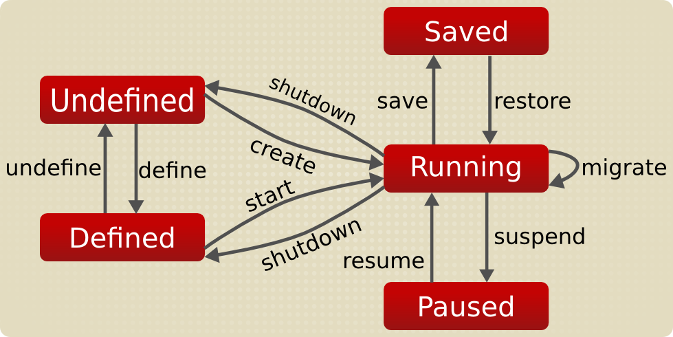

### Vagrant

Vagrant is basically a tool to automate deployment of virtual machines, basically same as Virtualbox/vmware or anything (infact it legitimately uses that as a backend) but is more acceptable and easier to use as a cli alternative. 

Things we will be talking about: 

1. Vagrant
2. Adding Boxes
3. Deleting boxes
4. Exposing Port
5. Bridging adapters
6. Mounting storages
7. Xforwarding and GUI things
8. Any queries or questions basically.

Things we won't talk about:

1. Creating vagrant boxes
2. QEMU
3. vagrant structural details
4. Anything overly complex.

(The machine you are using to create a VM is called as host and the virtual machine that you created is called as guest operating system)

#### Vagrant Introduction

In the exact words of hashicorp 
"the command line utility for managing the lifecycle of virtual machines."

##### Lifecycle of VM


[Source for Image](https://wiki.libvirt.org/page/VM_lifecycle)

Something that I simply take as: 
0. Create a VM

1. Start -> Boot -> Bootup 
2. Use the machine -> Reboot or Poweroff
3. Change config and reload 

Vagrant allows us to do all of this from our cli and in the most simple form. Basically what you need to do after installing vagrant is using it to deploy the vm. 

#### Guide to Using Vagrant

Let's review a lil, with vb, you used to create a disk image and thenn go ahead install os on the disk image using vb gui and then boot into it. The process with vagrant is similar, except here the disk image is VDI (it will expand automatically but won't get smaller automatically). 
The procedure here is like this: 

1. Get the `box`
2. Install the box and boot into it
3. Done :P

So how to get box via vagrant?
Pretty simple:
Goto [Vagrant Boxes](https://app.vagrantup.com/boxes/search) and search for the one you want.
In there you will see how to use it as vagrant, for example lets take up ubuntu tahr for our example.

```
# Create a directory for your boxes
mkdir -p ~/boxes/ubuntu && cd ~/boxes/ubuntu ; # 1
vagrant init ubuntu/trusty64 ; # 2
vagrant up ; # 3
```

Basically 

1. Creates a folder for your box
2. Downloads the box and puts it in ~/Virtualbox\ VMS
3. vagrant up is used to boot into the box

After vagrant up finishes you will get back to your terminal, now your vm is running like a charm. 
So as to use your vm, all you need to do now is 
`vagrant ssh`

At this point you can simply leave the lecture and be a happy man, as after this things are not super needed. But carry on if you need more.

#### Vagrant X-Forward

Inside the vm once you have ssh'd you can install xauth, and other things and edit the /etc/sshd/sshd_config to allow xforwarding, and then after that add the following to the vagrantfile config

```
config.ssh.forward_agent = true
config.ssh.forward_x11 = true
```

and then install tmux on your guest machine. After that exit from ssh session (by typing exit) and then in the folder type vagrant ssh-config (note that vagrant command for the particular box will only work in the very specific folder, it also has a vagrant file which contains very important settings)
in the vagrant ssh-config you will see location of a private-key that you can use for sshing,
so now you need to manually ssh into the box instead of vagrant ssh 

```
ssh -Y -i <path to the key> vagrant@127.0.0.1 -p <port in ssh-config>
```

Now after this, you can install firefox inside vm and then run `firefox &` and see firfox on your host machine and use it just fine.

#### Vagrant Shared Folder

Now so as to tranfer files you can simply cd /vagrant and use it just fine but do note that this might not work in cases where vb guest additions is not proper inside the guest operating system.

So you will have to install it, so as to install it all you need to do is: 
Inside the Guest OS

```
# Kei Tachikawa, [01.06.21 08:52]
cd ~
wget -c https://download.virtualbox.org/virtualbox/6.1.22/VBoxGuestAdditions_6.1.22.iso -O pew.iso 
# Here goto the link and notice the version 6.1.22.iso part, thats important.
sudo mount ~/pew.iso -o loop /mnt
cd /mnt
sudo VBoxLinuxAdditions.run --nox11
# --nox11 basically installs it via terminal and allows you to open vm in gui
reboot
```

Once done, it should work just fine or do additional debugging and see whats missing.

#### Vagrant Destroy

Now next that we need to discuss is how to delete boxes, well its again easy.
In the directory where you have the vagrant box, simply do.
`vagrant destroy`
and it will delete the vm and associated files. Please note here that, as per the process, VM and BOX are different. Box is something on the basis of which you create a vm. And VM technically copies the box, so in the even you think that you will never need a particular box ever, just do
`vagrant box remove <boxname>`

#### Vagrant Port forwarding

Vagrant forwarded ports allow you to access a port on your host machine and have all data forwarded to a port on the guest machine, over either TCP or UDP.

For example: If the guest machine is running a web server listening on port 80, you can make a forwarded port mapping to port 8080 (or anything) on your host machine. You can then open your browser to localhost:8080 and browse the website, while all actual network data is being sent to the guest.

```
Vagrant.configure("2") do |config|
  config.vm.network "forwarded_port", guest: 80, host: 8080
end
```

For further discussion on forwarding make sure to read this [Vagrant Official Documentation of Forwarding](https://www.vagrantup.com/docs/networking/forwarded_ports)

##### Vagrant Bridging

So as to bridge the network through your own adapter (bridging basically allows your guest machine to act as an individual machine in the network, so that it can take up ip from the router and act as your other computer)
Add the following to your vagrantfile config:

```
# Adding this would basically ask the interface you want to bridge to
config.vm.network "public_network", ip: "192.168.0.17"
# If you are like me and easily annoyed by things like that you can specify the interface too
config.vm.network "public_network", bridge: "en0"
```

This mostly covers everything you need to learn about vagrant and this basically works like a charm, I personally prefer the official documentations as they are really well written and can be used for reference anytime.

### References

1. [Vagrant Documentation](https://www.vagrantup.com/docs)
2. [Vagrant Tutorial](https://learn.hashicorp.com/collections/vagrant/getting-started)
3. [Vagrant Cheatsheet](https://pewpewnotes.github.io/vagrantCS.html)

Let me know in case you have any queries.
