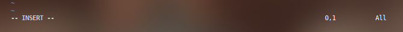
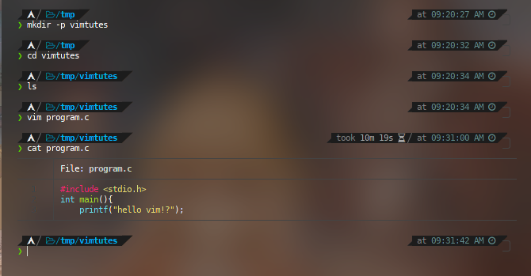
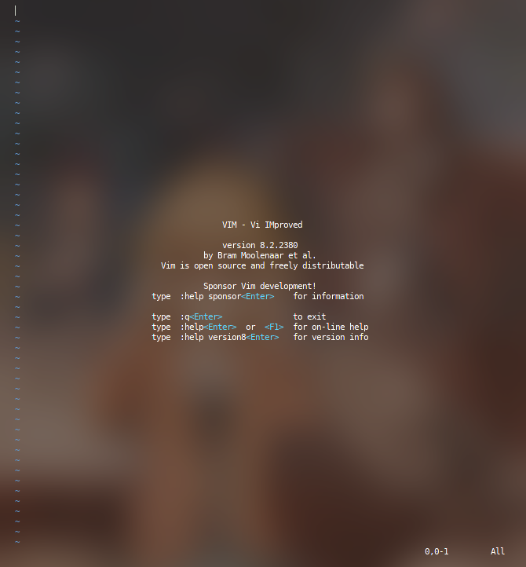

```
__     ___             _____      _             _       _ 
\ \   / (_)_ __ ___   |_   _|   _| |_ ___  _ __(_) __ _| |
 \ \ / /| | '_ ` _ \    | || | | | __/ _ \| '__| |/ _` | |
  \ V / | | | | | | |   | || |_| | || (_) | |  | | (_| | |
   \_/  |_|_| |_| |_|   |_| \__,_|\__\___/|_|  |_|\__,_|_|
```

***

### Vim and How it works?

Well, Simply put vi->vim is an editor which is so good that people make an IDE out of it.
Unlike the counterpart Emacs, vim is focussed solely on simplicity and 'modes'. It has been
created with Unix philosophy in mind, and is regarded as one of the best editors.
Even after a long time since its creation, it is still under use heavily and that proves how 
good it is. There are many flavours of vim, and for this tutorial I would totally recommend going
with neovim  (only if shiny appearance and ricing appeals you). Other than that this should mostly work for vim as well. I am not very well acquainted with vi as I have never used it for anything more than editing few config files here and there, but the basics stay the same.

### Plan

So how are we going to learn to use vim in like 20 minutes? the plan for that is simple. I will assume you have vim/neovim installed. If not, then please google/duckduck go search "How to install neovim(or vim) on NAME OF YOUR Operating System". If you are lazy and don't feel like looking it up,

* vim :: https://github.com/vim/vim
* neovim :: https://github.com/neovim/neovim 
  we are basically going to write a small C program in vim, No its not a programming tutorial (I am too bad at it) but its going to be a simple thing that we are going to write and see how vim allows us to do it nicely and fast.
  This guide is supposed to be used before vimtutor, because it mostly covers few things in normal and usable way (the way you'll be able to know how to use it).
  So, without further ado Let's dive in.

### Basics

***

Vim's editing is unlike other editors. So far we are used to writing and entering things we want to be written in a file right away and the press "Ctrl-s" to save the same (assuming you are from windows, command+s if from mac). Vim on the other hand uses the same buffer for both writing content and entering commands. To achieve that, vim uses 'ESC' key to toggle between 'INSERT' mode and 'COMMAND' mode. In insert mode, whatever you write goes into content of the file, in COMMAND mode whatever you write is interpreted as 'COMMAND' for vim.

"wait this is all very complex! and I don't get it"

yes, it was same for me too. I mean what does it all even mean? well simply put if you write ABCD in insert mode and save the file it will be written to the file, but if you write ABCD in command mode it wont be the same (Only BCD will be saved onto file, read on to find why). 

First thing we are going to do is start the terminal. This will vary as per your os and installation, and hopefully you did the installation correctly. In the terminal, 

`mkdir -p vimtutes` then, `cd vimtutes` and now, `vim program.c` This way vim will create a file and open it up for you. 

which should look something like this: 


here, notice all the information that is being given. Pay attention to bottom left, that is your filename (duh!) but that is also the place where your mode will be displayed. Now so as to enter into insert mode (remember Insert mode is the mode where whatever you write will go into the file. Thats exactly what we want!) press `i` This will basically change it to something like this: 



Now anything that you type will be saved in the buffer, which can be written onto disk as file (Buffer is smarty pants way of saying temporary storage). Go ahead and type to your heart's content. For starters let's write a simple program, which we will complete step by step. 

```c
#include <stdio.h>
int main(){
    printf("hello vim!?");
```

This program is intentionally incomplete, because we will be coming back to it, Now we want to save the file. So as to save it we are going to 'ESC' from insert mode. So as to go back to command mode, press `ESC` Key. (Its usually on the top left of keyboard).

Now commands can be entered in two ways. First is simple keys, like `a` `i` `j``k` `l` etc. And the other is colon way , like `:w` `:q!` `:! pew` things like that. We will look into it, but for now *Our aim is to save the file and exit vim!* To do that you can do `:wq` this basically asks vim to 'w'rite and 'q'uit. 


just like that, it shows up at the bottom left! and now press `ENTER` that will send the command to vim. 

we are back again to terminal, now you can `cat program.c` and you should be able to see that content is well written onto the file!



Congratulations! you have finished part 1 of your vim tutorial, its not over yet though. Lets again open the file but this time, we are going to do it all from inside vim.

type `vim` at terminal and you should be greeted with screen like this: 



Yes, now you should understand the most important thing that is how to get help in vim. And various other nice things. lets again open our program.c for that do, `:o program.c`then Enter, and wham! our code is right there. Don't touch it yet we are going to make it a little better now. First thing is we need to enable line numbers, because its easier to share code and ask for help if you know the line on which the problem is. There are two types of line numbering in vim, absolute and relative.But we will be sticking to absolute line numbering. (feel free to explore relative line numbering on your own as its very very helpful, if you want to be true vimmer!). So as to enable line number, you can type `:set number` and then enter and screen will change to something like this, 


yay, we enabled line numbers too. But look our code is wrong!! we need to go back to the last line and fix it asap. For that press `ESC` jump to last line, for this we will use non-colon form, press `GG` (notice that g is capital, basically press SHIFT+G+G). That will take you to last line right away, if you want to goto top of the code, simply press `gg` and it will go to top right away, you can also press `:1` to go to first line (number is basically the line number). Back to it, press `GG` and go to end, then use arrow keys to goto last and press `o`

`o` is same as insert mode except it starts insertion at the new line, which is same as pressing enter after going into insert mode. This allow you to skip one key and start editing, you should be able to see how quick this gets.

Let's finish our code.

```c
return 0;
}
```

This is a simple functioning C code, that we can compile and roll with. Now so as to save you can also press `ZZ` which will save and quit. This is all that is there to the guide, here is a list of commands that you can take in and try at your leisure. Also **Do make sure to go through vimtutor so as to learn the true vim way of editing files**

Also, make sure to research up more because there is a lot more to vim than this (this is like 1% of vim, but the very important thing). 
As far as eye candy and making it more usable goes, you can check out neovim and some of the neovim rices here: 
* My Config: https://github.com/Aeres-u99/dotfiles
* Optixal's: https://github.com/Optixal/neovim-init.vim
* Eric's: https://github.com/zSucrilhos/dotfiles

#### Where to go from here? 
These are few great books to give a try, 
* http://www.eandem.co.uk/mrw/vim/usr_doc/index.html
* http://sci.notbc.org/~weiss/resources/vim/Vim-course/others/vim-1.0.pdf
* https://leanpub.com/VimLikeAPro (Paid)
* https://www.linuxlinks.com/wp-content/uploads/2019/08/vim-recipes.pdf
****

#### Cursor Movement Commands

* h Moves the cursor one character to the left

* l Moves the cursor one character to the right

* k Moves the cursor up one line

* j Moves the cursor down one line

* nG or :n Cursor goes to the specified (n) line

(ex. 10G goes to line 10)


* ^F (CTRl F) Forward screenful

* ^B Backward screenful

* ^f One page forward

* ^b One page backward

* ^U Up half screenful

* ^D Down half screenful

* $ Move cursor to the end of current line

* 0 (zero) Move cursor to the beginning of current line

* w Forward one word

* b Backward one word


#### Exit Commands

* :wq Write file to disk and quit the editor

* :q! Quit (no warning)

* :q Quit (a warning is printed if a modified file has not been saved)

* ZZ Save workspace and quit the editor (same as :wq)

* : 10,25 w temp 
write lines 10 through 25 into file named temp. Of course, other line
numbers can be used. (Use :f to find out the line numbers you want.

#### Text Deletion Commands

* x Delete character

* dw Delete word from cursor on

* db Delete word backward

* dd Delete line

* d$ Delete to end of line

* d^ (d caret, not CTRL d) Delete to beginning of line

* **Yank** (has most of the options of delete)-- VI's **copy** commmand

* yy yank current line

* y$ yank to end of current line from cursor

* yw yank from cursor to end of current word

* 5yy yank, for example, 5 lines

* **Paste** (used after delete or yank to recover lines.)

* p paste below cursor

* P paste above cursor

* "2p paste from buffer 2 (there are 9)

* u Undo last change

* U Restore line

* J Join next line down to the end of the current line


#### File Manipulation Commands

* :w Write workspace to original file

* :w file Write workspace to named file

* :e file Start editing a new file

* :r file Read contents of a file to the workspace

**To create a page break,** 
while in the insert mode, press the CTRL key
And l. ^L will appear in your text and will cause the printer to start
A new page.
