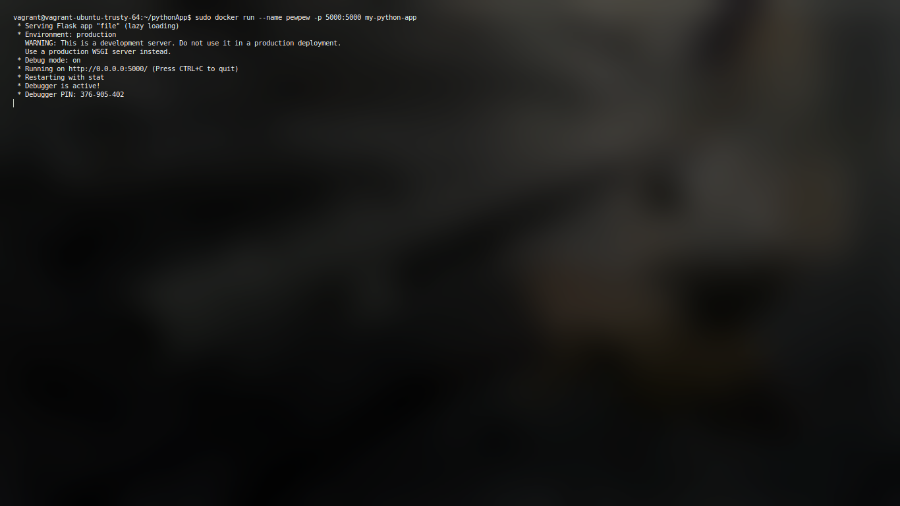
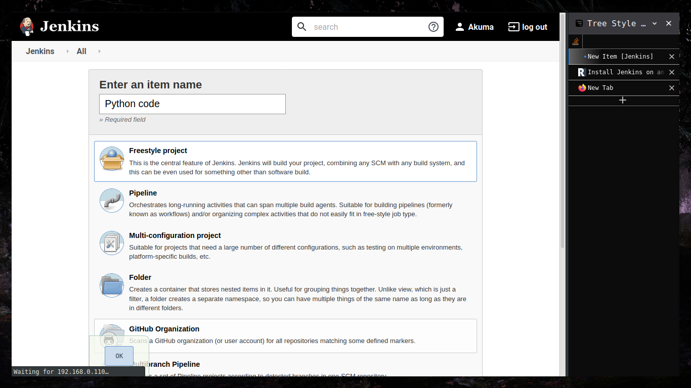
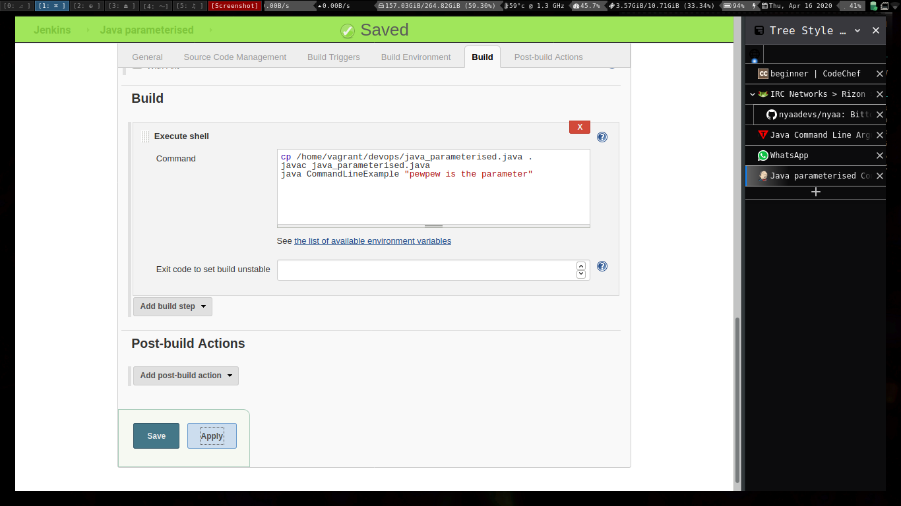

# Note
# Assignment 2

### Run a python program using DockerFile

Install flask (or requried dependencies for your programs) 
and write your respective code in file. 
Since you will be using pip for installing dependencies simply go ahead and write a requirements.txt as well

`echo "flask" > requirements.txt `

Code

```
from flask import Flask
app = Flask(__name__)
@app.route("/")
def hello():
    return "Hello World!"
if __name__ == "__main__":
    app.run(host="0.0.0.0", port=int("5000"), debug=True)
```

Now simply create a Dockerfile with the following content

```
FROM python:alpine3.7
COPY . /app
WORKDIR /app
RUN pip install -r requirements.txt
EXPOSE 5000
CMD python3 ./file.py
```


Now all thats left is to build the image and run it. 




Docker container running like pewpew :D 


| Name        | Abhishek Upadhyay |
| ----------- | ----------------- |
| Class       | BE IT A           |
| Roll Number | 47                |

# Devops Assignments

# Assignment 2

1. Dockerfile to host a DB server. 

2. Dockerfile to run a python3 program.
   
   ### Dockerfile to host a DB server.

`Create a Dockerfile to basically pull MARIADB and required fs from server`

```
# MariaDB 10.3 with SSH
# Pull the mariadb latest image
FROM mariadb:latest
# List all the packages that we want to install
ENV PACKAGES openssh-server openssh-client
# Install Packages
RUN apt-get update && apt-get install -y $PACKAGES
# Allow SSH Root Login
RUN sed -i 's|^#PermitRootLogin.*|PermitRootLogin yes|g' /etc/ssh/sshd_config
# Configure root password
RUN echo "root:root123" | chpasswd
```


Then simply run the following to run container
`docker build --rm=true -t severalnines/mariadb-ssh .`
then 
`docker images`


`
cd ~/Docker
mkdir datadir
mkdir configure
tail -1 /etc/mysql/my.cnf
!includedir /etc/mysql/conf.d/
`
Then execute the following to run container. 

```
docker run -d --name mariadb1 \
-p 33061:3306 \
-v ~/Docker/mariadb1/config:/etc/mysql/conf.d \
-v ~/Docker/mariadb1/datadir:/var/lib/mysql \
-e MYSQL_ROOT_PASSWORD=root123 \
-e MYSQL_DATABASE=dbtest \
mariadb
```


# Question 2

### Run a python program using DockerFile

Install flask (or requried dependencies for your programs) 
and write your respective code in file. 
Since you will be using pip for installing dependencies simply go ahead and write a requirements.txt as well

`echo "flask" > requirements.txt `

Code

```
from flask import Flask
app = Flask(__name__)
@app.route("/")
def hello():
    return "Hello World!"
if __name__ == "__main__":
    app.run(host="0.0.0.0", port=int("5000"), debug=True)
```

Now simply create a Dockerfile with the following content

```
FROM python:alpine3.7
COPY . /app
WORKDIR /app
RUN pip install -r requirements.txt
EXPOSE 5000
CMD python3 ./file.py
```


Now all thats left is to build the image and run it. 


Docker container running like pewpew :D 


# Devops Experiment 7

# Experiment 7

### To share data between host and docker using Volume.

In general, Docker containers are ephemeral, running just as long as it takes for the command issued in the container to complete, this is an important feature as well as a limitation. By default, any data created inside the container is only available from within the container and only while the container is running, meaning there is close to no standard means to spawn docker container for the standard purpose of programming and development.
A certain method of using volumes can enable the sharing of data. 
Docker volumes can be used to share files between a host system and the Docker container. For example, let’s say you wanted to use the official Docker Nginx image and keep a permanent copy of Nginx’s log files to analyze later. By default, the nginx Docker image will log to the `/var/log/nginx` directory inside the Docker Nginx container. Normally it’s not reachable from the host filesystem.

This example shall help us understand how to achieve the same. 

```
docker run --name=nginx -d\
 -v ~/nginxlogs:/var/log/nginx -p 5000:80 nginx
# --name for naming, -v for mounitng nginxlogs file, 5000:80 is basically for exposing # the port 80 of container as port 5000 of machine
```


With docker 1.9, there comes the capability of creating volumes which allows easy sharing of data between containers

To make use of the volume, we’ll create a new container from the Ubuntu image, using the --rm
flag to automatically delete it when we exit. We’ll also use -v to mount the new volume. -v
requires the name of the volume, a colon, then the absolute path to where the volume should
appear inside the container. If the directories in the path don’t exist as part of the image, they’ll
be created when the command runs. If they do exist, the mounted volume will hide the existing
content:

`docker run -ti --rm -v DataVolume1:/datavolume1 ubuntu`


We can also verify the DataVolume using following

```bash
vagrant@vagrant-ubuntu-trusty-64:~$ sudo docker volume inspect DataVolume1
[
    {
        "CreatedAt": "2020-04-20T14:55:34Z",
        "Driver": "local",
        "Labels": {},
        "Mountpoint": "/var/lib/docker/volumes/DataVolume1/_data",
        "Name": "DataVolume1",
        "Options": {},
        "Scope": "local"
    }
]
```

the output is in json which can be basically parsed using any known language and then can be used for Automation


# Devops Study
## Final Semester Practical

* This is basically meant to record all that I have done for my Devops Experimentation. 
* It must include the problems I faced and how I tackled them 
* The creation of VM will be the first thing
* It must be noted, that since it is to be used for college work **NO weebification**
* The repository is public and should be always available for public access. 

## Topics

` Create a Vagrant environment for clutterless environment`

1. Introduction to devops (handwritten)
2. Install and Configure Jenkins to test java applications
3. a) Practice shell code execution jenkins
   b) Parameterized programs using Jenkins for java.
   c) Python programs using Jenkins.
4. GIT commands for VCS
5. Install and configure docker
6. Apache web server using docker
    a) Using commandline
    b) Using Docker file (docker compose)
7. Share data between docker container and docker host using docker volumes
8. To share data between docker container using docker volumes
9. Install and configure Puppet software configuration management tool
10. Install and configure ansible push based configuration management tool (use vagrant)
11. LAMP stack configure and deploy using ansible playbook.   
    

    
# Create and Configure Vagrant box 
Vagrant is a tool for building and managing virtual machine environments in a single workflow. With an easy-to-use workflow and focus on automation, Vagrant lowers development environment setup time, increases production parity, and makes the "works on my machine" excuse a relic of the past

### How to create the setup box for our system? 

Since we just need a plain old ubuntu and we will be taking care of the rest of the installation over commandline, we dont need to be thinking a lot. 

```
vagrant init ubuntu/trusty64
vagrant up
```

This will give us a base machine, but the problem isnt resolved yet.

### How to make Servers available on host machine? 

For this purpose I usually go ahead and create the bridge network. Bridge network in simplest term is a VM that doesnt shares the MAC address of host and identifies itself uniquely to the Network. 
Really crucial as it prevents tonnes of portforward and portmaps also allows easier portforward from HOST machine, is it a good idea in production? well we dont know. 

Enabling a bridged network on a virtual machine managed by Vagrant is simple enough, using a single configuration directive in the Vagrantfile:

```
Vagrant::Config.run do |config|
  config.vm.network :bridged
end
```

If you are on an older version (like me :P)

```
config.vm.network "public_network"
```


After this, go ahead and find the private key for ssh

```
❯ vagrant ssh-config
Host default
  HostName 127.0.0.1
  User vagrant
  Port 2222
  UserKnownHostsFile /dev/null
  StrictHostKeyChecking no
  PasswordAuthentication no
  IdentityFile /home/akuma/SoopaProject/devops/.vagrant/machines/default/virtualbox/private_key
  IdentitiesOnly yes
  LogLevel FATAL
```

Use this key for ssh and with X forward 


```
ssh -X vagrant@127.0.0.1 -i /home/akuma/SoopaProject/pewpew/devops/.vagrant/machines/default/virtualbox/private_key
```

And you will be dropped in the shell. 
You can go ahead and install necessary tools like tmux and stuffs. 
# Installing and Configuring Jenkins

### Aim:
Installation and Configuration of Jenkins

#### Procedure and Screenshots.

Jenkins is an open source automation server that has become a crucial component in the likes of Kubernetes and GitOps. Jenkins enables the continuous integration and delivery of software. Jenkins includes a number of plugins to help the automation of building and deploying your applications. 

Steps for Installation: 
1. First of all, jenkins **needs** jdk, so on ubuntu vm of ours go ahead and issue: 

```
sudo apt update && sudo apt install default-jdk 
#if on ubuntu server, default-jdk-headless
#Once the installation finishes check the java version by, 
java -version.
```


2. Download and install the necessary GPG key with the command 

```
wget -q -O - https://pkg.jenkins.io/debian/jenkins.io.key | sudo apt-key add -
```
3. Add the necessary repository with the command 

```
sudo sh -c 'echo deb http://pkg.jenkins.io/debian-stable binary/ > /etc/apt/sources.list.d/jenkins.list'
```
4. Add the universe repository with the command 

```
sudo add-apt-repository universe
```
5. Update apt with the command ```sudo apt-get update```

6. Install Jenkins with the command

```
sudo apt-get install jenkins -y
```
Allow the installation to complete.


#### How to access Jenkins?

1. Open a web browser and point it to http://SERVER_IP:8080 (where SERVER_IP is the IP address of the hosting server). 

2. You will then be prompted to copy and paste a password that was created during the Jenkins installation. To retrieve that password, go back to the terminal window and issue the command:

```
sudo less /var/lib/jenkins/secrets/initialAdminPassword
```


Choose suggested plugins and then 
Create the first user 

Set the deafult path and you will be set to roll with jenkins. 


### Testing java applications on jenkins.


After correct configuration and proper build information


### Executing python programs using jenkins.




# Git Commands
### Git Experiments

#### Aim:
To study and practice commands for GIT and version control system

* Creation of Repository
```
#In a directory
git init
```
* Commiting a change
```
git commit -m "Updated stuffs"
```
* Stashing the change
```
git add . 
```
* Removing the commiting
```
git reset HEAD~
```
* Setting up a github remote
```
git remote add origin <remote url>
```
* Pushing to git remote
```
git push -u origin master
```
* Viewing the log
```
git log -p 
```


# Docker Installation and Configuration for Containerization

## Aim
To install docker and configure it for containerization. 

## ScreenShots:

Installation


Fixing installation (for older machines)


Configuration and Containerization

Pulling the docker image.

Running the container.


# Docker+Apache Webserver setup

# Note

#### How to access Jenkins?

1. Open a web browser and point it to http://SERVER_IP:8080 (where SERVER_IP is the IP address of the hosting server).

2. You will then be prompted to copy and paste a password that was created during the Jenkins installation. To retrieve that password, go back to the terminal window and issue the command:

```

sudo less /var/lib/jenkins/secrets/initialAdminPassword
```


Choose suggested plugins and then

Create the first user


Set the deafult path and you will be set to roll with jenkins.


# Experiment 3

# Aim:

### Testing java applications on jenkins. (paramterised and non parameterised)


After correct configuration and proper build information


### Java Parameterised.




Running the build.


### Executing python programs using jenkins.


# Experiment 4

### Git Experiments

# Aim:

To study and practice commands for GIT and version control system

* Creation of Repository

```

#In a directory

git init
```

* Commiting a change

```bash
git commit -m "Updated stuffs"
```

* Stashing the change

```bash
git add .
```

* Removing the commiting

```bash
git reset HEAD~
```

* Setting up a github remote

```bash
git remote add origin <remote url>
```

* Pushing to git remote

```bash
git push -u origin master
```

* Viewing the log

```
git log -p
```


# Experiment 5

# Aim:

To install and configure docker for containerization.

# ScreenShots:

Installation


Fixing installation (for older machines)


Configuration and Containerization

Pulling the docker image.


Running the container.


# Experiment 6

## Aim:

To containerize Apache in docker 

a) using commandline 

b) Using DOCKERFILE


### Containerization using Command line

```bash
sudo docker run --name WebServerProper -p 81:80 -t -i ubuntu /bin/bash
```


Once inside the prompt, 

```bash
apt update && apt install apache2 
```


```bash
service apache2 start
```

That will start the apache webserver on docker container


### Containerization using DOCKERFILE

Start with creating a base directory and creating two files 

```bash
mkdir DockerHTTPD && cd DockerHTTPD
```

```bash
# Write in a file named apache-conf
    Mutex file:${APACHE_LOCK_DIR} default
    PidFile ${APACHE_PID_FILE}
    Timeout 300
    KeepAlive On
    MaxKeepAliveRequests 100
    KeepAliveTimeout 5
    User ${APACHE_RUN_USER}
    Group ${APACHE_RUN_GROUP}
    HostnameLookups Off
    ErrorLog ${APACHE_LOG_DIR}/error.log
    LogLevel warn
    IncludeOptional mods-enabled/*.load
    IncludeOptional mods-enabled/*.conf
    Include ports.conf
     
    <Directory />
        Options FollowSymLinks
        AllowOverride None
        Require all denied
    </Directory>
    <Directory /usr/share>
        AllowOverride None
        Require all granted
    </Directory>
    <Directory /var/www/>
        Options Indexes FollowSymLinks
        AllowOverride All
        Require all granted
    </Directory>
     
    AccessFileName .htaccess
     
    <FilesMatch "^\.ht">
        Require all denied
    </FilesMatch>
     
    LogFormat "%v:%p %h %l %u %t \"%r\" %>s %O \"%{Referer}i\" \"%{User-Agent}i\"" vhost_combined
    LogFormat "%h %l %u %t \"%r\" %>s %O \"%{Referer}i\" \"%{User-Agent}i\"" combined
    LogFormat "%h %l %u %t \"%r\" %>s %O" common
    LogFormat "%{Referer}i -> %U" referer
    LogFormat "%{User-agent}i" agent
     
    IncludeOptional conf-enabled/*.conf
    IncludeOptional sites-enabled/*
```

```dockerfile
    FROM ubuntu:16.04
     
    # Apache ENVs
    ENV APACHE_RUN_USER www-data
    ENV APACHE_RUN_GROUP www-data
    ENV APACHE_LOCK_DIR /var/lock/apache2
    ENV APACHE_LOG_DIR /var/log/apache2
    ENV APACHE_PID_FILE /var/run/apache2/apache2.pid
    ENV APACHE_SERVER_NAME localhost
     
    # Install services, packages and do cleanup
    RUN apt-get update \
     && apt-get install -y \
        apache2 \
     && rm -rf /var/lib/apt/lists/*
     
    # Copy files
    COPY apache-conf /etc/apache2/apache2.conf
     
    # Expose Apache
    EXPOSE 80
     
    # Launch Apache
    CMD ["/usr/sbin/apache2ctl", "-DFOREGROUND"]
```


Build the container using 

```bash
docker build -t webserver_img .
```


After that, simply run the resultant container and yay!

```bash
docker run -i -t -d -p 5000:80 --name=webserver_con webserver_img
```


### Aim:

Installation and Configuration of Jenkins

### Procedure and Screenshots.

Jenkins is an open source automation server that has become a crucial component in the likes of Kubernetes and GitOps. Jenkins enables the continuous integration and delivery of software. Jenkins includes a number of plugins to help the automation of building and deploying your applications.

Steps for Installation:

1. First of all, jenkins **needs** jdk, so on ubuntu vm of ours go ahead and issue:

```

sudo apt update && sudo apt install default-jdk

#if on ubuntu server, default-jdk-headless

#Once the installation finishes check the java version by,

java -version.
```


2. Download and install the necessary GPG key with the command

```

wget -q -O - https://pkg.jenkins.io/debian/jenkins.io.key | sudo apt-key add -
```

3. Add the necessary repository with the command

```

sudo sh -c 'echo deb http://pkg.jenkins.io/debian-stable binary/ > /etc/apt/sources.list.d/jenkins.list'
```

4. Add the universe repository with the command

```

sudo add-apt-repository universe
```

5. Update apt with the command ```sudo apt-get update```

6. Install Jenkins with the command

```

sudo apt-get install jenkins -y
```

Allow the installation to complete.


#### How to access Jenkins?

1. Open a web browser and point it to http://SERVER_IP:8080 (where SERVER_IP is the IP address of the hosting server).

2. You will then be prompted to copy and paste a password that was created during the Jenkins installation. To retrieve that password, go back to the terminal window and issue the command:

```

sudo less /var/lib/jenkins/secrets/initialAdminPassword
```


Choose suggested plugins and then

Create the first user


Set the deafult path and you will be set to roll with jenkins.


