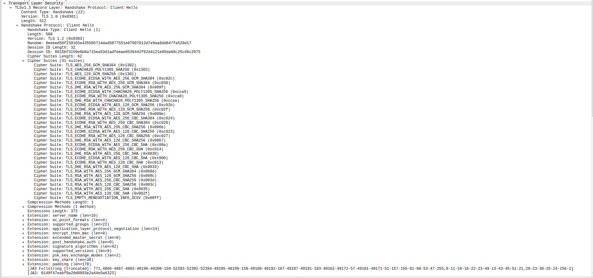

### Understanding SSL

Well, ssl is complex stuffs. I don't know it well, but I wanted to know it better, so I went ahead and looked into it further. 
The entire "research" and "understanding" was performed to basically understand how `green-tunnel` works, I kinda wanted to port it to golang/C for performance reasons. 
My level of understanding is not enough, and there must be many mistakes. A good insight into it is always helpful

***

#### Setup

Before setting up, the issue I have always had with lots of traffic data is there is so much and we get lost into understanding and reading a pcap.
It becomes complicated easily and I lose track of what the quack I was supposed to be doing.

So as to solve this, I wanted to use the new founded knowledge of mine. Network namespaces.
Plan is to create a network namespace, then use it to create a veth pair, where in one of the pair stays in namespace, and the other in linux user namespace. And then, the traffic from the one in linux namespace is natted
through `wlan0` this allows network connectivity over things

We will be able to monitor the one inside the namespace and get only the secluded traffic and the perfect things.

1. Create the network namespace: `sudo ip netns add monitor0`
2. Create the pair of virtual network interfaces: `sudo ip link add veth-a type veth peer name veth-b`
3. Put the `veth-a` inside the namespace: `sudo ip link set veth-a netns monitor0`
4. Configure some ip addresses for the interfaces: `sudo ip netns exec monitor0 ifconfig veth-a up 192.168.163.1 netmask 255.255.255.0`, Also for veth-b `sudo ifconfig veth-b up 192.168.163.254 netmask 255.255.255.0`
5. Configure the routing: `sudo ip netns exec monitor0 route add default gw 192.168.163.254 dev veth-a`
6. Enable ip_forward and allow nat rules: `echo 1 | sudo tee /proc/sys/net/ipv4/ip_forward; iptables -t nat -A POSTROUTING -s 192.168.163.0/24 -o wlan0 -j SNAT --to-source 192.168.0.103`

**NOTE:** 

* `wlan0` is my own machine's wifi interface
* `192.168.0.103` is my machine's ip address. 

Once done with these steps we are ready to roll in with magical stuffs

* `sudo ip netns exec monitor0 bash`
* Inside `monitor0` : `export SSLKEYLOGFILE="/somefolder/on/your/machine"` This is a necessary step that will allow us to decrypt TLS traffic in wireshark, which is a lot more readable and simpler.
* `tmux`

Now, tmux is absolutely upto your taste. You can use anything else to your fancy.
In first pane, start wireshark and enable capturing. Most probably, that will spew a lots of ARP traffic, which we can filter out or ignore (its lesser than before!)
Next step is to go in wireshark `Edit` > `Preferences` > `Left column search for protocols` > `TLS` Earlier this used to be ssl, but then ssl was superseded by TLS

* https://superuser.com/questions/1430350/ssl-protocol-seems-to-be-missing-in-wireshark
* https://www.rfc-editor.org/rfc/rfc7568 

In second pane we will simply start wireshark and in the other we will go ahead and do a simple `curl https://example.org`
Now this should generate the traffic capture, the capture should be different for you in terms of values. But the general outline should be hopefully correct. 

* Capture:

The first thing that happens in TLS is Client Hello, this is basically like saying "hey server, sup? I can talk in all these languages and all these ways, wbu?"

As you can see it includes Random and Session ID which I presume won't be visible in `SSLKEYLOGFILE` based capture.

To this server ACKs the packet that was received. In my case this was a simple ACK packet, and not a SACK, 

I am not sure about the reason why, but I am guessing this could be because the server here is making a HelloRetry, perhaps it didn't supported some of the communication cipher specs that had to be re-evaluated.

Ahh, upon searching I stumbled across this

https://ldapwiki.com/wiki/HelloRetryRequest

quoting from here

> HelloRetryRequest or Hello Retry Request is a [TLS 1.3](https://ldapwiki.com/wiki/TLS%201.3) message sent by the [server](https://ldapwiki.com/wiki/Server) will send this message in response to a [ClientHello](https://ldapwiki.com/wiki/ClientHello) message if it is able to find an acceptable set of parameters but the [ClientHello](https://ldapwiki.com/wiki/ClientHello) does **not** contain sufficient information to proceed with the [TLS Handshake](https://ldapwiki.com/wiki/TLS%20Handshake).

This could have been because the client is basically curl. (just a hunch)

No, I am incorrect, its basically telling the best possible cipher spec that its aware of which is `0x1302` which is Cipher Suite: TLS_AES_256_GCM_SHA384 (0x1302)

This is one of the supported protocols 

As we see in quoted text, the server is basically requesting more information on the same and our client, understands and sends ack. 

And like a good client, sends more information

Seeing this server ACKS

next, server gives it hello in the agreed upon convention, which makes sense.

Server sends its certificate to client for the verification purposes, this is going to be used by client to verify the server is who he tells himself to be.

Client acks

Client probably verifies the packet here, and finishes the handshake if it feels its valid. 

Retrieving the servers public key from the certificate the client goes ahead and encrypts the data with servers public key, there by securing the communication. 

HTTP 2 data is now being sent in the TCP packet

(Truncated few ack packets to directly jump here. I didn't wanted to go into the depths of HTTP2 "yet")

To which server responds with the required data. As we know this is a tad bit boring part, but yes. This makes an absolute sense to understand how this works

